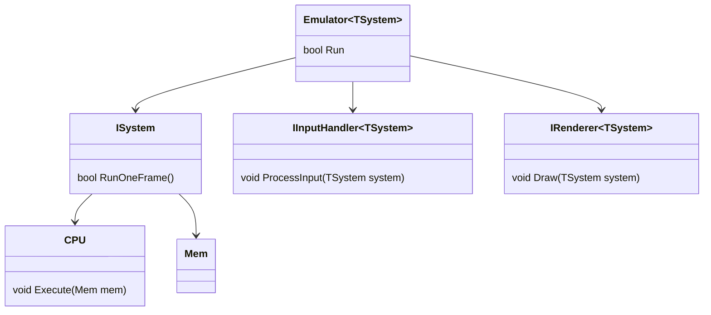

```mermaid
classDiagram
Emulator~TSystem~ --> ISystem
Emulator~TSystem~ --> IInputHandler~TSystem~
Emulator~TSystem~ --> IRenderer~TSystem~

ISystem --> CPU
ISystem --> Mem
ISystem : bool RunOneFrame()

CPU : void Execute(Mem mem)

IRenderer~TSystem~ : void Draw(TSystem system)
IInputHandler~TSystem~ : void ProcessInput(TSystem system)

Emulator~T~ : bool Run
```