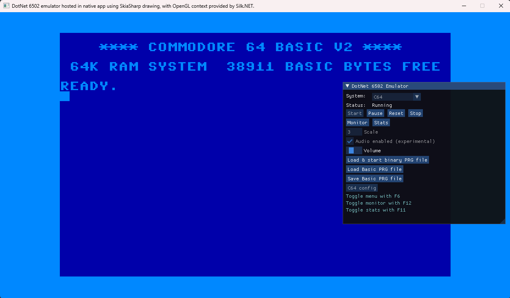

<h1 align="center">Highbyte.DotNet6502.App.SkiaNative</h1>

# Overview


# Features
Native cross-platform app written in .NET with a Window from Silk.NET, using a SkiaSharp renderer (from ```Highbyte.DotNet6502.Impl.Skia```) and a Silk.NET input handler (from ```Highbyte.DotNet6502.Impl.SilkNet```).

Uses Silk.NET [ImGui extensions](https://www.nuget.org/packages/Silk.NET.OpenGL.Extensions.ImGui/) to render UI for interactive menu, monitor, and stats window.

# System: C64 
A directory containing the C64 ROM files (Kernal, Basic, Chargen) is supplied by the user, and set in the appsettings.json file.

# System: Generic computer 
TODO

# UI

## Menu
A toggleable main menu by pressing F6.

## Monitor
A toggleable machine code monitor window by pressing F12.

## Stats
A toggleable stats window by pressing F11.
