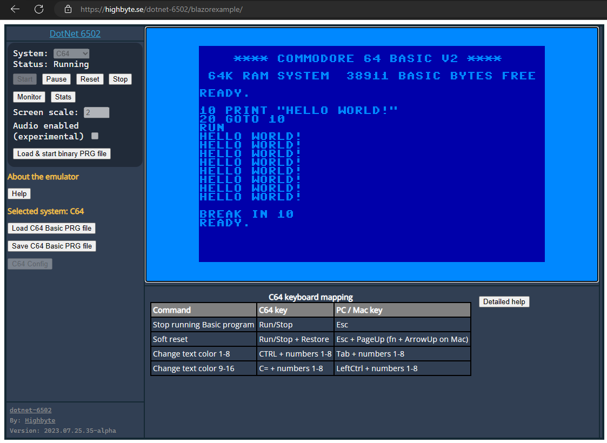

<h1 align="center">Highbyte.DotNet6502.App.SkiaWASM</h1>

# Overview



A deployed version can be found here [https://highbyte.se/dotnet-6502/blazorexample](https://highbyte.se/dotnet-6502/blazorexample)

# Features
A web app written in Blazor WASM (Web Assembly), using [```SkiaSharp.Views.Blazor```](https://www.nuget.org/packages/SkiaSharp.Views.Blazor) library to provide a Canvas for drawing on with main [```SkiaSharp```](https://www.nuget.org/packages/SkiaSharp) library.

# System: C64 
Via C64 config UI you have to upload binaries for the ROMs that a C64 uses (Kernal, Basic, Chargen).

# System: Generic computer 
The example 6502 machine code that is loaded and run by default for the _Generic_ computer is this a assembled version of [this 6502 assembly code](../Examples/Assembler/Generic/hostinteraction_scroll_text_and_cycle_colors.asm)


# Monitor
A Blazor WASM implementation of the [machine code monitor](../Highbyte.DotNet6502.Monitor/MONITOR.md) is available by pressing ~ or §.

# How to run locally

For system requirements, see details [here](../DEVELOP#Requirements)

## Visual Studio 2022 (Windows)

Open solution ```dotnet-6502.sln```.
Set project ```Highbyte.DotNet6502.App.SkiaWASM``` as startup, and start with F5.

## From command line (Windows, Linux, Mac)
``` 
cd ./Highbyte.DotNet6502.App/Highbyte.DotNet6502.App.SkiaWASM
dotnet run
```
Open browser at http://localhost:5000.
