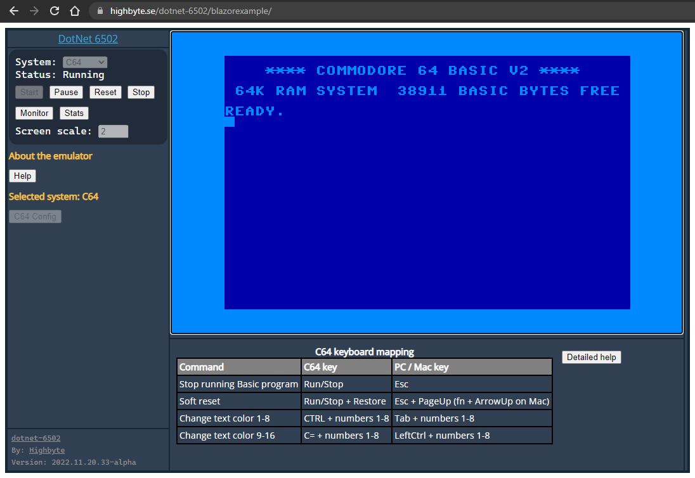
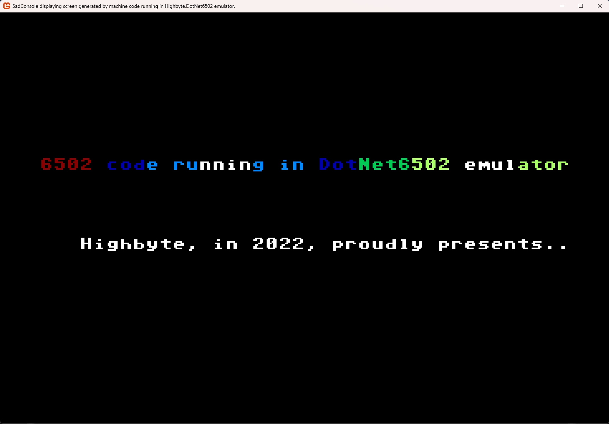

<h1 align="center">dotnet-6502</h1>

| | |
| ------------- | ------------- |
| SonarCloud: ```Highbyte.DotNet6502``` library  | [](https://sonarcloud.io/dashboard?id=highbyte_dotnet-6502) [](https://sonarcloud.io/dashboard?id=highbyte_dotnet-6502) [](https://sonarcloud.io/project/issues?id=highbyte_dotnet-6502&resolved=false&types=VULNERABILITY) [](https://sonarcloud.io/dashboard?id=highbyte_dotnet-6502) [](https://sonarcloud.io/project/issues?id=highbyte_dotnet-6502&resolved=false&types=BUG) [](https://sonarcloud.io/component_measures?id=highbyte_dotnet-6502&metric=coverage&view=list) |
| CodeQL: Overall                        |  [](https://github.com/highbyte/dotnet-6502/actions/workflows/codeql-analysis.yml) |

---

## A [6502 CPU](https://en.wikipedia.org/wiki/MOS_Technology_6502) emulator for .NET

[](https://highbyte.se/dotnet-6502/blazorexample)

# Overview / purpose

- A collection of .NET cross platform libraries and applications for executing 6502 CPU machine code in different contexts. Links below for details on each library/app.

- **_A programming exercise, that may or may not turn into something more_**

- A main library [```Highbyte.DotNet6502```](Highbyte.DotNet6502/CPU_LIBRARY.md) for executing 6502 machine code, not bound to any specific computer, and does not have any UI code.

- A machine code monitor library [```Highbyte.DotNet6502.Monitor```](Highbyte.DotNet6502.Monitor/MONITOR.md) used as a base for specific UI implementations.

- A library [```Highbyte.DotNet6502.Systems```](Highbyte.DotNet6502.Systems/SYSTEMS.md) containing implementations of specific computers ("Systems") that runs on a 6502 CPU.

- Several libraries [```Highbyte.DotNet6502.Impl.*```](Highbyte.DotNet6502.Impl/RENDERERS_AND_INPUTHANDLERS.md) that implements rendering and input handling using different technologies (such as Skia, Blazor, SadConsole) per emulated System.

- Several UI applications [```Highbyte.DotNet6502.Apps.*```](Highbyte.DotNet6502.App/APPS.md) that are the hosts for emulating the Systems above and their different rendering techniques.

# What's currently missing
Including but not limited to:
- 6502 CPU
  - Decimal mode (Binary Coded Decimal) calculations
  - Support for unofficial opcodes
- Systems
  - C64: Emulation of graphics mode, sprites, cycle-exact rendering, etc.

# What this isn't (and probably never will be)
- An emulation of all aspects of computers such as Apple II or Commodore 64.
- The fastest emulator.

# How to develop
For requirements and local development setup, see [here](DEVELOP.md)

# Inspiration, references & resources

## 6502 CPU Emulator in C++ video
- https://www.youtube.com/playlist?list=PLLwK93hM93Z13TRzPx9JqTIn33feefl37

## 6502 CPU references
- http://www.obelisk.me.uk/6502/index.html
- https://www.atariarchives.org/alp/appendix_1.php
- http://www.6502.org/tutorials/compare_beyond.html
- https://www.c64-wiki.com/wiki/BRK
- http://www.emulator101.com/6502-addressing-modes.html
- https://www.pagetable.com/?p=410

## C64 specific references
- https://www.c64-wiki.com/wiki/Reset_(Process)
- https://www.c64-wiki.com/wiki/Bank_Switching
- https://www.pagetable.com/c64ref/c64mem/
- https://sta.c64.org/cbm64mem.html
- https://github.com/mist64/c64ref/blob/master/Source/c64io/c64io_mapc64.txt
- https://www.c64-wiki.com/wiki/PETSCII_Codes_in_Listings
- https://dustlayer.com/vic-ii/2013/4/22/when-visibility-matters
- https://dustlayer.com/vic-ii/2013/4/25/vic-ii-for-beginners-beyond-the-screen-rasters-cycle

## Test programs
- http://visual6502.org/wiki/index.php?title=6502TestPrograms
- https://github.com/Klaus2m5/6502_65C02_functional_tests/blob/master/6502_functional_test.a65
- http://www.csharp4u.com/2017/01/getting-pretty-hex-dump-of-binary-file.html?m=1

## Assemblers
Was used during development to compile actual 6502 source code to a binary, and then run it through the emulator.

- https://marketplace.visualstudio.com/items?itemName=rosc.vs64
- https://nurpax.github.io/c64jasm-browser/
- https://skilldrick.github.io/easy6502/#first-program

## Monitors / Emulators
Was used during development to test how certain instructions worked when in doubt.

### VICE
Monitor commands: https://vice-emu.sourceforge.io/vice_12.html

How to load and step through a program in the VICE monitor
```
l "C:\Source\Repos\dotnet-6502\.cache\Examples\Assembler\Generic\testprogram.prg" 0 1000
d 1000
r PC=1000
z
r
```

## Credits
- [Kristoffer Strube](https://github.com/KristofferStrube) for the original Blazor WASM async interop code for [WebAudio](https://github.com/KristofferStrube/Blazor.WebAudio), [DOM](https://github.com/KristofferStrube/Blazor.DOM), and [IDL](https://github.com/KristofferStrube/Blazor.WebIDL) that was the basis for a synchronous implementation in this repo. Copyright notice [here](Highbyte.DotNet6502.Impl/Highbyte.DotNet6502.Impl.AspNet/JSInterop/JSInterop_OriginalLicense.MD).
