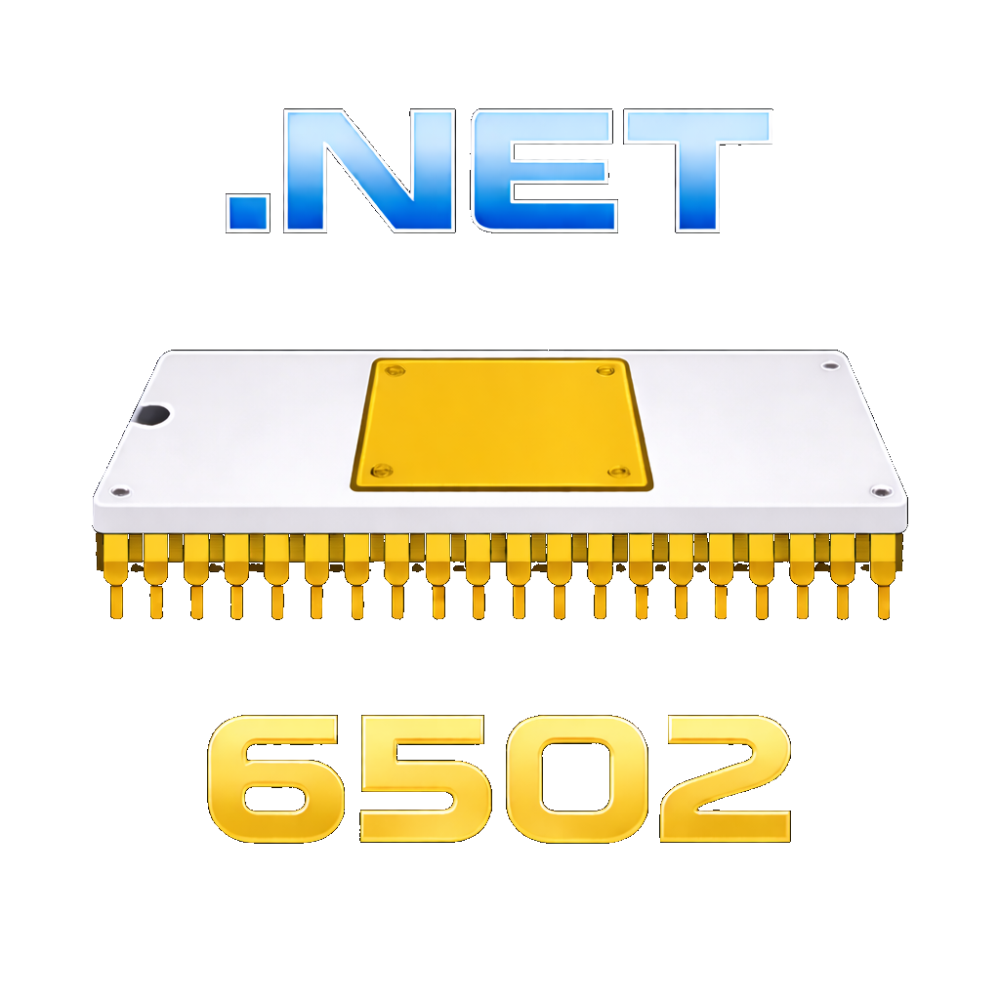
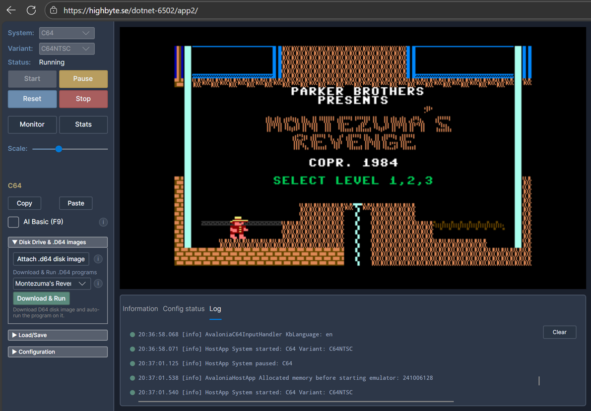
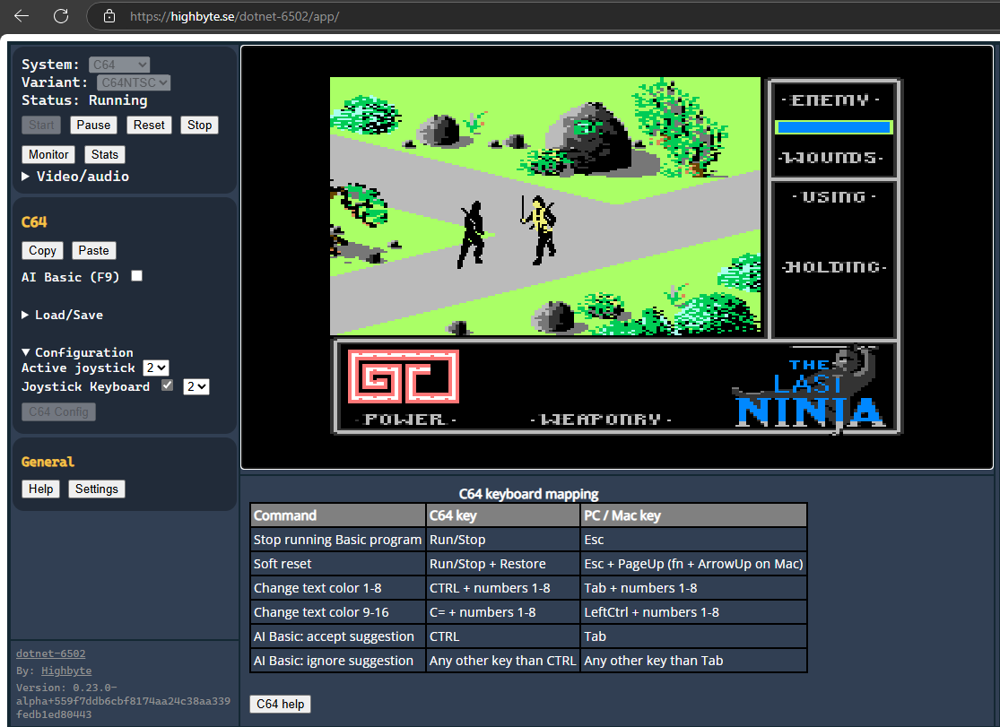
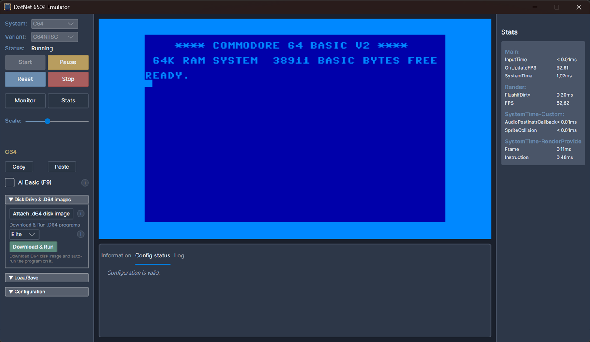
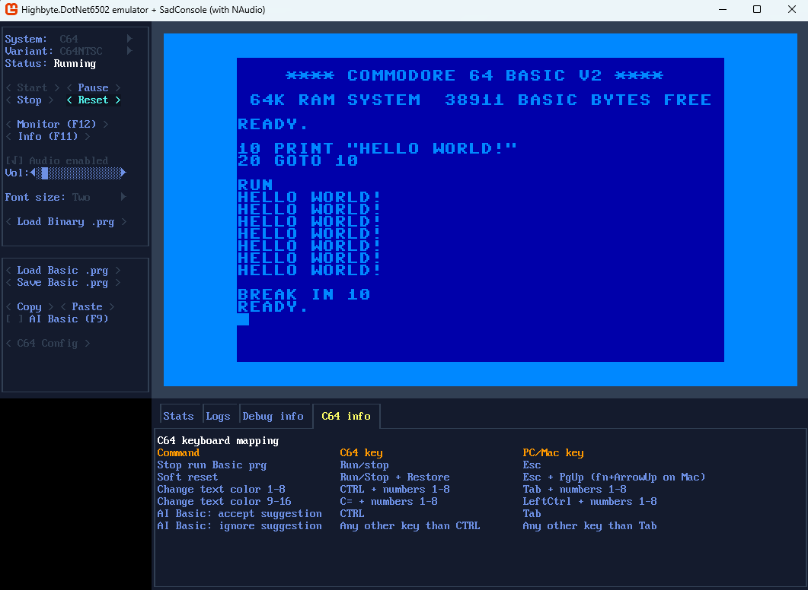
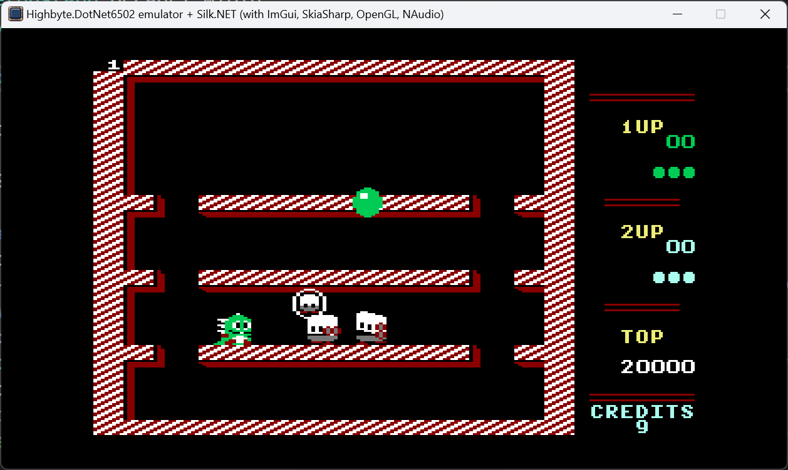

  

<h2 align="center"> 
  A <a href="https://en.wikipedia.org/wiki/MOS_Technology_6502">6502 CPU</a> emulator for .NET
</h2>

# Overview / purpose

.NET cross platform libraries and applications for executing 6502 CPU machine code, and emulating specific computer systems (such as Commodore 64) in different UI contexts. Links below for details on each library/app.

> [!IMPORTANT]
> This is mainly a programming exercise, that may or may not turn into something more. See [Limitations](#limitations) below.

## Web apps

| [Avalonia WebAssembly app](doc/APPS_AVALONIA.md)| [Blazor WebAssembly app](doc/APPS_BLAZOR_WASM.md) |
| ----------------------------------------------- | ------------------------------------------------- |
|  |  | 

## Desktop apps

|[Avalonia desktop app](doc/APPS_AVALONIA.md) | [SadConsole desktop app](doc/APPS_SADCONSOLE.md) | [SilkNet desktop app](doc/APPS_SILKNET_NATIVE.md) |
| ------------------------------------------- | ------------------------------------------------ | ------------------------------------------------- |
|  |  |  |

See [Desktop Apps](doc/DESKTOP_APPS.md) for download links for pre-built executables and instructions for Windows, Linux, and macOS.

## Other features

| [Run 6502 machine code in your own .NET apps](doc/CPU_LIBRARY.md)  | [Machine code monitor](doc/MONITOR.md) | [C64 Basic AI code completion](doc/SYSTEMS_C64_AI_CODE_COMPLETION.md) | 
| -------------------------------------------- | -------------------------------------- | --------------------------------------------------------------------- |
|  |  |  |

## Common libraries
- [`Highbyte.DotNet6502`](doc/CPU_LIBRARY.md) 
  - Core library for executing 6502 machine code, not bound to any specific emulated system/computer, and does not have any UI or I/O code.
- [`Highbyte.DotNet6502.Monitor`](doc/MONITOR.md)
  - Machine code monitor library used as a base for host apps using the `Highbyte.DotNet6502` library.
- [`Highbyte.DotNet6502.Systems`](doc/SYSTEMS.md)
  - Library for common interfaces and implementations for running computers ("systems") that uses the `Highbyte.DotNet6502` library.

## System/computer-specific libraries
Contains core system/computer emulation logic, but with no UI or I/O dependencies.
Implements abstractions in `Highbyte.DotNet6502.Systems`.
- [`Highbyte.DotNet6502.Systems.Commodore64`](doc/SYSTEMS_C64.md) 
  - Logic for emulating a Commodore 64 (C64).
  - Runs C64 ROMs (Kernal, Basic, Chargen).
  - List of apps/games listed that's been tested to work [here](doc/SYSTEMS_C64_COMPATIBLE_PRG.md)

- [`Highbyte.DotNet6502.Systems.Generic`](doc/SYSTEMS_GENERIC.md) 
  - Logic for emulating a generic computer based on 6502 CPU.

## System-specific libraries for I/O
Implements rendering, input handling, and audio using different technologies per emulated system/computer. Implements abstractions in `Highbyte.DotNet6502.Systems`. These libraries are used from relevant UI host apps (see below).
- [`Highbyte.DotNet6502.Impl.AspNet`](doc/RENDER_INPUT_AUDIO.md#library-highbytedotnet6502implaspnet)
  - General system-specific input and audio code for AspNet Blazor `WASM` app.
- [`Highbyte.DotNet6502.Impl.Avalonia`](doc/RENDER_INPUT_AUDIO.md#library-highbytedotnet6502implavalonia)
  - General and system-specific render and input code for `Avalonia` (browser and desktop) apps .
- [`Highbyte.DotNet6502.Impl.Browser`](doc/RENDER_INPUT_AUDIO.md#library-highbytedotnet6502implbrowser)
  - General JavaScript input code for `Avalonia` browser app.
- [`Highbyte.DotNet6502.Impl.NAudio`](doc/RENDER_INPUT_AUDIO.md#library-highbytedotnet6502implnaudio) 
  - General and system-specific audio code for `Avalonia` (browser and desktop), `SilkNetNative` and `SadConsole` apps.
- [`Highbyte.DotNet6502.Impl.SadConsole`](doc/RENDER_INPUT_AUDIO.md#library-highbytedotnet6502implsadconsole) 
  - General and system-specific rendering and input code for `SadConsole` app.
- [`Highbyte.DotNet6502.Impl.SilkNet`](doc/RENDER_INPUT_AUDIO.md#library-highbytedotnet6502implsilknet) 
  - General and system-specific rendering (OpenGL shaders) and input code for `SilkNetNative` app.
- [`Highbyte.DotNet6502.Impl.SilkNet.SDL`](doc/RENDER_INPUT_AUDIO.md#library-highbytedotnet6502implsilknetsdl) 
  - General and system-specific input code for `Avalonia` desktop app.
- [`Highbyte.DotNet6502.Impl.Skia`](doc/RENDER_INPUT_AUDIO.md#library-highbytedotnet6502implskia)
  - General and system-specific rendering with SkiaSharp for `SilkNetNative`, and Blazor `WASM` apps.

## Other apps
### [`Highbyte.DotNet6502.App.ConsoleMonitor`](doc/APPS_CONSOLE_MONITOR.md)

## C64 Basic AI code completion
See [here](doc/SYSTEMS_C64_AI_CODE_COMPLETION.md)

# Limitations
> [!IMPORTANT]
> - Correct emulation of all aspects of computers such as Commodore 64 is not likely.
> - Not the fastest emulator.
> - A real Commodore 64 uses the _6510_ CPU and not the 6502 CPU. But for the purpose of this emulator the 6502 CPU works fine as they are generally the same (same instruction set).
> - Code coverage is currently limited to the core [`Highbyte.DotNet6502`](doc/CPU_LIBRARY.md) library.

Missing features (but not limited to):
- 6502 CPU
  - Support for unofficial opcodes.
- Systems
  - Commodore 64: cycle-exact rendering, full disk drive support, tape drive support, accurate/stable audio, etc.

# How to develop
See [here](doc/DEVELOP.md)

# References 
See [here](doc/REFERENCES_AND_INSPIRATION.md).

# Credits
- [Kristoffer Strube](https://github.com/KristofferStrube) for the original Blazor WASM async interop code for [WebAudio](https://github.com/KristofferStrube/Blazor.WebAudio), [DOM](https://github.com/KristofferStrube/Blazor.DOM), and [IDL](https://github.com/KristofferStrube/Blazor.WebIDL) that was the basis for a synchronous implementation in this repo. Copyright notice [here](src/libraries/Highbyte.DotNet6502.Impl.AspNet/JSInterop/JSInterop_OriginalLicense.MD).
