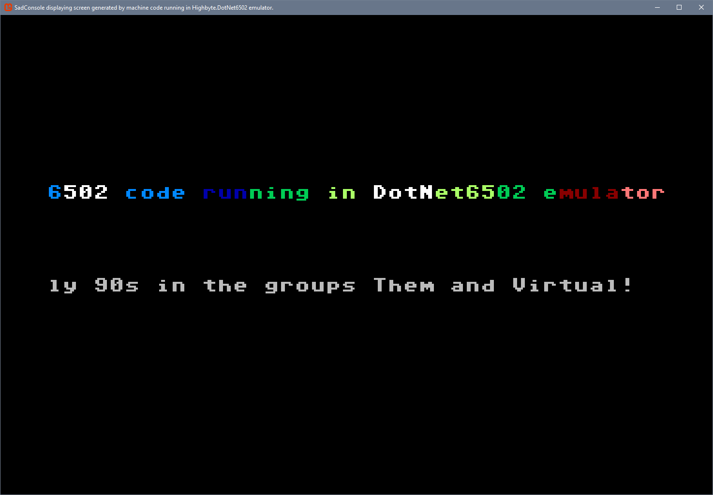

# dotnet-6502

[](https://sonarcloud.io/dashboard?id=highbyte_dotnet-6502) [](https://sonarcloud.io/dashboard?id=highbyte_dotnet-6502) [](https://sonarcloud.io/project/issues?id=highbyte_dotnet-6502&resolved=false&types=VULNERABILITY) [](https://sonarcloud.io/dashboard?id=highbyte_dotnet-6502) [](https://sonarcloud.io/project/issues?id=highbyte_dotnet-6502&resolved=false&types=BUG) [](https://sonarcloud.io/component_measures?id=highbyte_dotnet-6502&metric=coverage&view=list)

A [6502 CPU](https://en.wikipedia.org/wiki/MOS_Technology_6502) emulator for .NET

What it (currently) does/is
- .NET 5 cross platform library written in C#
- Emulation of a 6502 processor
- Supports all official 6502 opcodes
- Can load an assembled 6502 program binary and execute it
- Passes this [Functional 6502 test program](https://github.com/Klaus2m5/6502_65C02_functional_tests)
- Monitor (rudimentary)
- A companion library to enable emulator interaction with a [SadConsole](https://sadconsole.com/) window
- Example programs
- **_A programming excerise, that may or may not turn into something more_**

What's (currently) missing
- Decimal mode (Binary Coded Decimal) calculcations
- Support for unofficial opcodes

What it isn't (and probably never will be)
- An emulation of an entire computer (such as Apple II or Commodore 64)
- The fastest emulator

Inspiration for this library was a [Youtube-series](https://www.youtube.com/watch?v=qJgsuQoy9bc&list=PLLwK93hM93Z13TRzPx9JqTIn33feefl37) about implementing a 6502 emulator in C++

# Table of Contents
- [Requirements](#requirements)
- [How to use Highbyte.DotNet6502 library from a .NET application](#how-to-use-highbytedotnet6502-library-from-a-net-application)
- [How to use Highbyte.DotNet6502.SadConsoleHost library from a .NET application](#how-to-use-highbytedotnet6502sadconsolehost-library-from-a-net-application)
- [How to use Highbyte.DotNet6502 machine code monitor](#how-to-use-highbytedotnet6502-machine-code-monitor)
  - [Get source](#get-source)
  - [Run with dotnet](#run-with-dotnet)
  - [Or build and run executable](#or-build-and-run-executable)
  - [Monitor commands](#monitor-commands)
- [How to develop](#how-to-develop)
- [Tests](#tests)
  - [Unit tests](#unit-tests)
  - [Functional test](#functional-integration-test)
  - [Code coverate report locally](#code-coverage-report-locally)
- [Resources](#6502-resources)

# Requirements
- [.NET 5 SDK](https://dotnet.microsoft.com/download/dotnet/5.0) installed.
- Use Windows, Linux, or Mac

# How to use Highbyte.DotNet6502 library from a .NET application
## Reference NuGet package
Add GitHub Packages source. _Depending on platform, you may have to use option ```--store-password-in-clear-text```._

_(if/when this package will live on nuget.org, adding a source would not be needed)_
``` powershell
dotnet nuget add source https://nuget.pkg.github.com/highbyte/index.json --name "github-highbyte" --username [your-git-username] --password [your-git-personal-access-token]
```
Add reference to the NuGet package in your application
```
dotnet add package Highbyte.DotNet6502 --prerelease
```

## Or compile .dll yourself
- Clone this repo ```git clone https://github.com/highbyte/dotnet-6502.git```
- Change dir to library ```cd dotnet-6502/Highbyte.DotNet6502```
- Build library ```dotnet build```
- In your app, add .dll reference to ```./bin/Debug/net5.0/Highbyte.DotNet6502.dll```

## Example of basic usage of Highbyte.DotNet6502 library

Example #1. Load compiled 6502 binary and execute it.
```c#
  var mem = BinaryLoader.Load(
      "C:\Binaries\MyCompiled6502Program.prg", 
      out ushort loadedAtAddress);
      
  var computerBuilder = new ComputerBuilder();
  computerBuilder
      .WithCPU()
      .WithStartAddress(loadedAtAddress)
      .WithMemory(mem);
      
  var computer = computerBuilder.Build();
  computer.Run();  
```  

Example #2. 6502 machine code for adding to numbers and dividing by 2
```c#
  // Test program 
  // - adds values from two memory location
  // - divides it by 2 (rotate right one bit position)
  // - stores it in another memory location

  // Load input data into memory
  byte value1 = 12;
  byte value2 = 30;
  ushort value1Address = 0xd000;
  ushort value2Address = 0xd001;
  ushort resultAddress = 0xd002;
  var mem = new Memory();
  mem[value1Address] = value1;
  mem[value2Address] = value2;

  // Load machine code into memory
  ushort codeAddress = 0xc000;
  ushort codeInsAddress = codeAddress;
  mem[codeInsAddress++] = 0xad;         // LDA (Load Accumulator)
  mem[codeInsAddress++] = 0x00;         //  |-Lowbyte of $d000
  mem[codeInsAddress++] = 0xd0;         //  |-Highbyte of $d000
  mem[codeInsAddress++] = 0x18;         // CLC (Clear Carry flag)
  mem[codeInsAddress++] = 0x6d;         // ADC (Add with Carry, adds memory to accumulator)
  mem[codeInsAddress++] = 0x01;         //  |-Lowbyte of $d001
  mem[codeInsAddress++] = 0xd0;         //  |-Highbyte of $d001
  mem[codeInsAddress++] = 0x6a;         // ROR (Rotate Right, rotates accumulator right one bit position)
  mem[codeInsAddress++] = 0x8d;         // STA (Store Accumulator, store to accumulator to memory)
  mem[codeInsAddress++] = 0x02;         //  |-Lowbyte of $d002
  mem[codeInsAddress++] = 0xd0;         //  |-Highbyte of $d002
  mem[codeInsAddress++] = 0x00;         // BRK (Break/Force Interrupt) - emulator configured to stop execution when reaching this instruction

  // Initialize emulator with CPU, memory, and execution parameters
  var computerBuilder = new ComputerBuilder();
  computerBuilder
      .WithCPU()
      .WithStartAddress(codeAddress)
      .WithMemory(mem)
      .WithInstructionExecutedEventHandler( 
          (s, e) => Console.WriteLine(OutputGen.FormatLastInstruction(e.CPU, e.Mem)))
      .WithExecOptions(options =>
      {
          options.ExecuteUntilInstruction = OpCodeId.BRK; // Emulator will stop executing when a BRK instruction is reached.
      });
  var computer = computerBuilder.Build();

  // Run program
  computer.Run();
  Console.WriteLine($"Execution stopped");
  Console.WriteLine($"CPU state: {OutputGen.GetProcessorState(computer.CPU)}");
  Console.WriteLine($"Stats: {computer.CPU.ExecState.InstructionsExecutionCount} instruction(s) processed, and used {computer.CPU.ExecState.CyclesConsumed} cycles.");

  // Print result
  byte result = mem[resultAddress];
  Console.WriteLine($"Result: ({value1} + {value2}) / 2 = {result}");
```  
generates this output
``` console
C000  AD 00 D0  LDA $D000  
C003  18        CLC        
C004  6D 01 D0  ADC $D001  
C007  6A        ROR A      
C008  8D 02 D0  STA $D002  
C00B  00        BRK        
Execution stopped
CPU state: A=15 X=00 Y=00 PS=[-----I--] SP=FD PC=0000
Stats: 6 instruction(s) processed, and used 23 cycles.
Result: (12 + 30) / 2 = 21
```

# How to use Highbyte.DotNet6502.SadConsoleHost library from a .NET application
The companion library ```Highbyte.DotNet6502.SadConsoleHost``` provides an easy way for letting 6502 code running in the ```Highbyte.DotNet6502``` emulator interacting with a [SadConsole](https://sadconsole.com/) window for a _text-based_ user interface (with possibility of colors and custom fonts).

The ```Highbyte.DotNet6502.SadConsoleHost``` library overview:
- Initializes the SadConsole library with a window to display screen data from code running in the 6502 emulator.
- Your 6502 code running in the emulator 
  - is run every frame (SadConsole event handler) until your code sets a specific flag in a memory location, indicating that its done for current frame.
  - should use specific memory-ranges where it stores text and color information.
- The text and color information from the emulator memory is then rendered in the SadConsole window.

With the same principle, keyboard events are also communicated from SadConsole to the emulator via memory addresses.

## Example of basic usage of Highbyte.DotNet6502.SadConsoleHost library

- Create a new SadConsole .NET project (reference the SadConsole documentation for details). Output type in the .csproj file should be ```<OutputType>WinExe</OutputType>```.
``` shell
mkdir demo
cd demo
dotnet new --install SadConsole.Templates::1.0.5
dotnet new sadconsole8
```
- Edit .csproj file and change ```<TargetFramework>netcoreapp3.1</TargetFramework>``` to ```<TargetFramework>net5.0</TargetFramework>```
- Add reference to ```Highbyte.DotNet6502.SadConsoleHost``` (which will also get you the main emulator library ```Highbyte.DotNet6502```)
``` shell
dotnet add package Highbyte.DotNet6502.SadConsoleHost --prerelease
```
- Add reference to configuration libraries
``` shell
dotnet add package Microsoft.Extensions.Configuration.Json
dotnet add package Microsoft.Extensions.Configuration.Binder
```
- Replace Program.cs with this code:
```c#
using Highbyte.DotNet6502.SadConsoleHost;
using Microsoft.Extensions.Configuration;
using System.IO;

namespace Demo
{
    class Program
    {
        private static IConfiguration Configuration;

        static void Main()
        {
            // Get config options
            var builder = new ConfigurationBuilder()
             .SetBasePath(Directory.GetCurrentDirectory())
             .AddJsonFile("appsettings.json");
            Configuration = builder.Build();

            var emulatorHostOptions = new Options();
            Configuration.GetSection(Options.ConfigSectionName).Bind(emulatorHostOptions);

            // Init EmulatorHost and run!
            var emulatorHost = new EmulatorHost(emulatorHostOptions);
            emulatorHost.Start();
        }        

    }
}
```

- Create a ```appsettings.json``` file where you configure where your compiled 6502 program is, and what memory addresses your 6502 program uses for displaying text and colors.

``` jsonc
{
  "Highbyte.DotNet6502.SadConsoleHost": {

    "SadConsoleConfig": {
      "WindowTitle": "SadConsole with Highbyte.DotNet6502 emulator!",
    },

    "EmulatorConfig": {
      "ProgramBinaryFile": "../my_cool_6502_program.prg",

      "Memory": {
        "Screen": {
          "Cols": 80,
          "Rows": 25,
          "ScreenStartAddress":           "0x0400",   //80*25 = 2000 (0x07d0) -> range 0x0400 - 0x08cf
          "ScreenColorStartAddress":      "0xd800",   //80*25 = 2000 (0x07d0) -> range 0xd800 - 0xdfcf
          "ScreenRefreshStatusAddress":   "0xd000",   // The 6502 code should set bit 1 here when it's done for current frame
          "ScreenBorderColorAddress":     "0xd020",
          "ScreenBackgroundColorAddress": "0xd021",
          "DefaultBgColor":               "0x00",     // 0x00 = Black (C64 scheme)
          "DefaultFgColor":               "0x0f",     // 0x0f = Light grey (C64 scheme)
          "DefaultBorderColor":           "0x0b"      // 0x0b = Dark grey (C64 scheme)
        },
        "Input": {
          "KeyPressedAddress":            "0xd030",
          "KeyDownAddress":               "0xd031",
          "KeyReleasedAddress":           "0xd032"
        } 
      }
    }
  }
}
```

_TODO: Detailed information on how to configure, and simple 6502 example code. See example app below for complete implementation._

## Example applications
### Highbyte.DotNet6502.SadConsoleHost demo
Example of a [SadConsole](https://sadconsole.com/) application running compiled 6502 [assembly code](Examples/SadConsoleTest/AssemblerSource/hostinteraction_scroll_text_and_cycle_colors.asm) in the emulator, using ```Highbyte.DotNet6502.SadConsoleHost``` library to let the emulator interact with text-based screen provided by [SadConsole](https://sadconsole.com/). The scrolling is choppy due to text-mode only, but the color-cycling works ok. Tested on Windows and Ubuntu.

``` 
cd ./Examples/SadConsoleTest
dotnet run
```



### Standard OS text console example
Some example 6502 assembly programs running in the emulator from a standard OS console application.

[Examples/ConsoleTestPrograms](Examples/ConsoleTestPrograms)
- Run16bitMultiplyProgram.cs
- HostInteractionLab_Scroll_Text.cs
- etc.

# How to use Highbyte.DotNet6502 machine code monitor
A machine code monitor console application for the Highbyte.DotNet6502 emulator library. It allows for some basic interaction with the emulator.

## Get source
- Clone this repo ```git clone https://github.com/highbyte/dotnet-6502.git```
- Change dir to monitor application ```cd dotnet-6502/Highbyte.DotNet6502.Monitor```

## Run with dotnet
- ```dotnet run```

## Or build and run executable
- Compile the source code with ```dotnet build```
- Run executable
  - Windows: ```.\bin\Debug\net5.0\Highbyte.DotNet6502.Monitor.exe```
  - Linux: ```./bin/Debug/net5.0/Highbyte.DotNet6502.Monitor```
  - Mac: ```./bin/Debug/net5.0/Highbyte.DotNet6502.Monitor```

## Monitor commands
Type ```?|help|-?|--help``` to list commands.
```
> ?
Usage:  [command]

Commands:
  d  Disassembles 6502 code from emulator memory.
  f  Fill memory att specified address with a list of bytes. Example: f 1000 20 ff ab 30
  g  Change the PC (Program Counter) to the specified address and execute code.
  l  Load a 6502 binary into emulator memory.
  m  Show contents of emulator memory in bytes.
  q  Quit monitor.
  r  Show processor status and registers. CY = #cycles executed.
  z  Single step through instructions. Optionally execute a specified number of instructions.
```

Type ```[command] -?|--help``` to list help on specific command.

Example on help for ```d``` (disassemble) command:
```
> d -?
Usage:  d [options] <start> <end>

Arguments:
  start         Start address (hex). If not specified, the current PC address is used.
  end           End address (hex). If not specified, a default number of addresses will be shown from start.

Options:
  -?|-h|--help  Show help information.
```

Example how to load binary with ```l``` command:

_The machine code binary simple.prg adds two number from memory, divides by 2, stores it in another memory location_
```
> l C:\Source\dotnet-6502\.cache\Example\ConsoleTestPrograms\AssemblerSource\simple.prg
File loaded at 0xC000
```

Example how to disassemble with ```d``` command:

_Shows what the code in simple.prg does_
```
> d c000 c010
c000  ad 00 d0  LDA $D000
c003  18        CLC
c004  6d 01 d0  ADC $D001
c007  6a        ROR A
c008  8d 02 d0  STA $D002
c00b  00        BRK
c00c  00        BRK
c00d  00        BRK
c00e  00        BRK
c00f  00        BRK
c010  00        BRK
```

Example how to fill bytes in memory with ```f``` command:

_Sets value A and B in memory locations (d000 and d001) that simple.prg uses_
```
> f d000 12 30
```

Example how to set PC (Program Counter) with ```r pc``` command:

_Sets PC at load address of simple.prg_
```
> r pc c000
SP=00 PC=C000
```

Example how to execute  ```g``` command:

_Executes simple.prg, stops on BRK instruction_
```
> g c000
Will stop on BRK instruction.
Staring executing code at c000
Stopped at                0000
c00b  00        BRK
```

Example how to show contents of bytes in memory with ```m``` command:

_Inspects values A (d000), B (d001), and result (d002)_
```
> m d000 d002
d000  12 30 21
```


# How to develop
- Use Windows, Linux, or Mac.
- [.NET 5 SDK](https://dotnet.microsoft.com/download/dotnet/5.0) installed.
- Develop in VSCode (Windows, Linux, Mac), Visual Studio 2019 (Windows), or other preferred editor.

# Tests
Most of the code has been developed with a test-first approach.

The [XUnit](https://xunit.net/) library is used.

## Unit tests
To run only unit tests:

```powershell
dotnet test --filter TestType!=Integration
```

## Functional (integration) test
There is a special XUnit test that is running the test code found here: [Functional 6502 test program](https://github.com/Klaus2m5/6502_65C02_functional_tests/blob/master/6502_functional_test.a65)

The purpose of it is to verify if an emulator (or real computer) executes the 6502 instructions correctly.

Notes on the special functional/integration XUnit test 
- it downloads the [Functional 6502 test program](https://github.com/Klaus2m5/6502_65C02_functional_tests/blob/master/6502_functional_test.a65) from the repo
- it modifies the .asm source code to disable Decimal tests
- it compiles the .asm source code with the AS65 assembler (bundled in the repo above)
- it loads the compiled 6502 binary into this emulator, and runs it.
- this emulator is configured to stop executing when the program reaches a specific "success" address (where the program loops forever).
- it currently requires a Windows machine to run due to the AS65 assembler. There may be a Java-version of it that could possibly be used instead.

To run only the special functional/integration XUnit test:

```powershell
dotnet test --filter TestType=Integration
```

## Code coverage report locally

Install report-generator global tool
```powershell
dotnet tool install -g dotnet-reportgenerator-globaltool
```

Generate and show reports (Windows)
```powershell
./codecov-browser.ps1
./codecov-console.ps1
```

Generate and show reports (Linux)
```shell
chmod +x ./codecov-console.sh
./codecov-console.sh
```

# 6502 Resources

## 6502 CPU Emulator in C++ video
- https://www.youtube.com/playlist?list=PLLwK93hM93Z13TRzPx9JqTIn33feefl37

## Reference material
- http://www.obelisk.me.uk/6502/index.html
- https://www.atariarchives.org/alp/appendix_1.php
- http://www.6502.org/tutorials/compare_beyond.html
- https://www.c64-wiki.com/wiki/Reset_(Process)
- https://www.c64-wiki.com/wiki/BRK
- https://sta.c64.org/cbm64mem.html
- http://www.emulator101.com/6502-addressing-modes.html
- https://www.pagetable.com/?p=410

## Test programs
- http://visual6502.org/wiki/index.php?title=6502TestPrograms
- https://github.com/Klaus2m5/6502_65C02_functional_tests/blob/master/6502_functional_test.a65
- http://www.csharp4u.com/2017/01/getting-pretty-hex-dump-of-binary-file.html?m=1

## Assemblers
Was used during develoment to compile actual 6502 source code to a binary, and then run it through the emulator.

- https://marketplace.visualstudio.com/items?itemName=rosc.vs64
- https://nurpax.github.io/c64jasm-browser/
- https://skilldrick.github.io/easy6502/#first-program

## Monitors / Emulators
Was used during development to test how certain instructions worked when in doubt.

### VICE
Monitor commands: https://vice-emu.sourceforge.io/vice_12.html

How to load and step through a program in the VICE monitor
```
l "C:\Source\Repos\dotnet-6502\.cache\ConsoleTestPrograms\AssemblerSource\testprogram.prg" 0 1000
d 1000
r PC=1000
z
r
```
