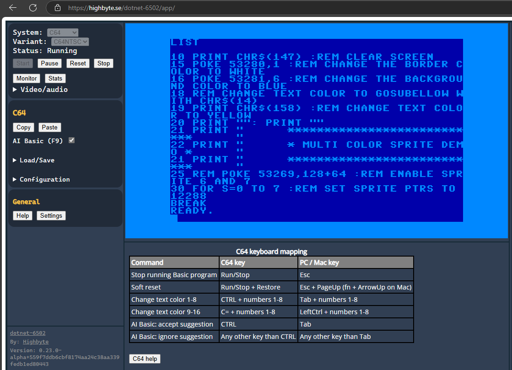
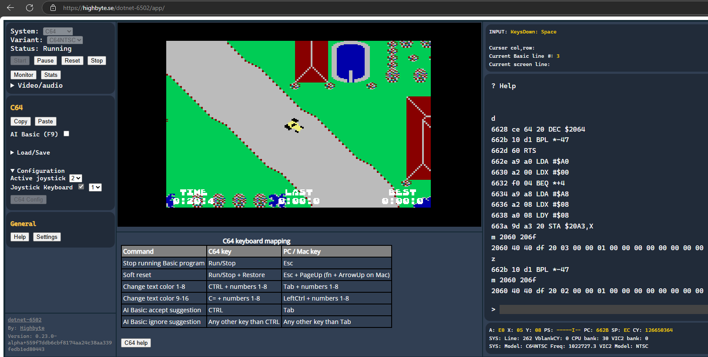

  

<h2 align="center"> 
  A <a href="[src/Test.java](https://en.wikipedia.org/wiki/MOS_Technology_6502)">6502 CPU</a> emulator for .NET
</h2>

  

# Overview / purpose

.NET cross platform libraries and applications for executing 6502 CPU machine code, and emulating specific computer systems in different UI contexts. Links below for details on each library/app.

> [!IMPORTANT]
> This is mainly a programming exercise, that may or may not turn into something more. See [Limitations](#limitations.md) below.

## Common libraries
- [`Highbyte.DotNet6502`](doc/CPU_LIBRARY.md) 
  - Core library for executing 6502 machine code, not bound to any specific emulated system/computer, and does not have any UI or I/O code.
- [`Highbyte.DotNet6502.Monitor`](doc/MONITOR.md)
  - Machine code monitor library used as a base for host apps using the `Highbyte.DotNet6502` library.
- [`Highbyte.DotNet6502.Systems`](doc/SYSTEMS.md)
  - Library for common interfaces and implementations for running computers ("systems") that uses the `Highbyte.DotNet6502` library.

## System/computer-specific libraries
Contains core system/computer emulation logic, but with no UI or I/O dependencies.
Implements abstractions in `Highbyte.DotNet6502.Systems`.
- [`Highbyte.DotNet6502.Systems.Commodore64`](doc/SYSTEMS_C64.md) 
  - Logic for emulating a Commodore 64 (C64).
  - Runs C64 ROMs (Kernel, Basic, Chargen).
  - List of apps/games listed that's been tested to work [here](doc/SYSTEMS_C64_COMPATIBLE_PRG.md) (and how to load them).

- [`Highbyte.DotNet6502.Systems.Generic`](doc/SYSTEMS_GENERIC.md) 
  - Logic for emulating a generic computer based on 6502 CPU.

## System-specific libraries for I/O
Implements rendering, input handling, and audio using different technologies per emulated system/computer. Implements abstractions in `Highbyte.DotNet6502.Systems`. These libraries are used from relevant UI host apps (see below).
- [`Highbyte.DotNet6502.Impl.AspNet`](doc/RENDER_INPUT_AUDIO.md#library-highbytedotnet6502implaspnet)
  - System-specific input and audio code for AspNet Blazor `WASM` app.
- [`Highbyte.DotNet6502.Impl.NAudio`](doc/RENDER_INPUT_AUDIO.md#library-highbytedotnet6502implnaudio) 
  - System-specific audio code for NAudio for use in native `SilkNetNative` and `SadConsole` apps.
- [`Highbyte.DotNet6502.Impl.SadConsole`](doc/RENDER_INPUT_AUDIO.md#library-highbytedotnet6502implsadconsole) 
  - System-specific rendering and input code for `SadConsole` native app.
- [`Highbyte.DotNet6502.Impl.SilkNet`](doc/RENDER_INPUT_AUDIO.md#library-highbytedotnet6502implsilknet) 
  - System-specific rendering (OpenGL shaders) for use in native `SilkNetNative` app.
- [`Highbyte.DotNet6502.Impl.Skia`](doc/RENDER_INPUT_AUDIO.md#library-highbytedotnet6502implskia)
  - System-specific rendering with SkiaSharp for use in native `SilkNetNative` and Blazor `WASM` apps.

## UI host apps that runs emulators
UI host apps for emulating the systems/computers above, using different I/O techniques (rendering, input, audio).

### [`Highbyte.DotNet6502.App.WASM`](doc/APPS_WASM.md)

A [`ASP.NET Blazor`](https://dotnet.microsoft.com/en-us/apps/aspnet/web-apps/blazor) WebAssembly UI.
  - Rendering: `Highbyte.DotNet6502.Impl.Skia`
  - Input: `Highbyte.DotNet6502.Impl.AspNet` 
  - Audio: `Highbyte.DotNet6502.Impl.AspNet`

   

### [`Highbyte.DotNet6502.App.SilkNetNative`](doc/APPS_SILKNET_NATIVE.md)
A [Silk.NET](https://github.com/dotnet/Silk.NET) native UI.
  - Rendering: `Highbyte.DotNet6502.Impl.Skia` or `Highbyte.DotNet6502.Impl.SilkNet`
  - Input: `Highbyte.DotNet6502.Impl.SilkNet` 
  - Audio: `Highbyte.DotNet6502.Impl.NAudio` 

   

### [`Highbyte.DotNet6502.App.SadConsole`](doc/APPS_SADCONSOLE.md)
A [`SadConsole`](https://github.com/Thraka/SadConsole) (a ascii/console/game engine) native UI.
  - Rendering: `Highbyte.DotNet6502.Impl.SadConsole`
  - Input: `Highbyte.DotNet6502.Impl.SadConsole` 
  - Audio: `Highbyte.DotNet6502.Impl.NAudio` 

   

### [`Highbyte.DotNet6502.App.ConsoleMonitor`](doc/APPS_CONSOLE_MONITOR.md)
A console application with a only UI being a machine code monitor.
  - Rendering: standard .NET console
  - Input: standard .NET console
  - Audio: none

 

# Limitations
> [!IMPORTANT]
> - Correct emulation of all aspects of computers such as Commodore 64 is not likely.
> - Not the fastest emulator.
> - Code coverage is currently limited to the core [`Highbyte.DotNet6502`](doc/CPU_LIBRARY.md) library.

Missing features (but not limited to):
- 6502 CPU
  - Support for unofficial opcodes.
- Systems
  - C64: cycle-exact rendering, disk/tape drive support, accurate/stable audio, etc.

# How to develop
See [here](doc/DEVELOP.md)

# References 
See [here](doc/REFERENCES_AND_INSPIRATION.md).

# Credits
- [Kristoffer Strube](https://github.com/KristofferStrube) for the original Blazor WASM async interop code for [WebAudio](https://github.com/KristofferStrube/Blazor.WebAudio), [DOM](https://github.com/KristofferStrube/Blazor.DOM), and [IDL](https://github.com/KristofferStrube/Blazor.WebIDL) that was the basis for a synchronous implementation in this repo. Copyright notice [here](src/libraries/Highbyte.DotNet6502.Impl.AspNet/JSInterop/JSInterop_OriginalLicense.MD).
