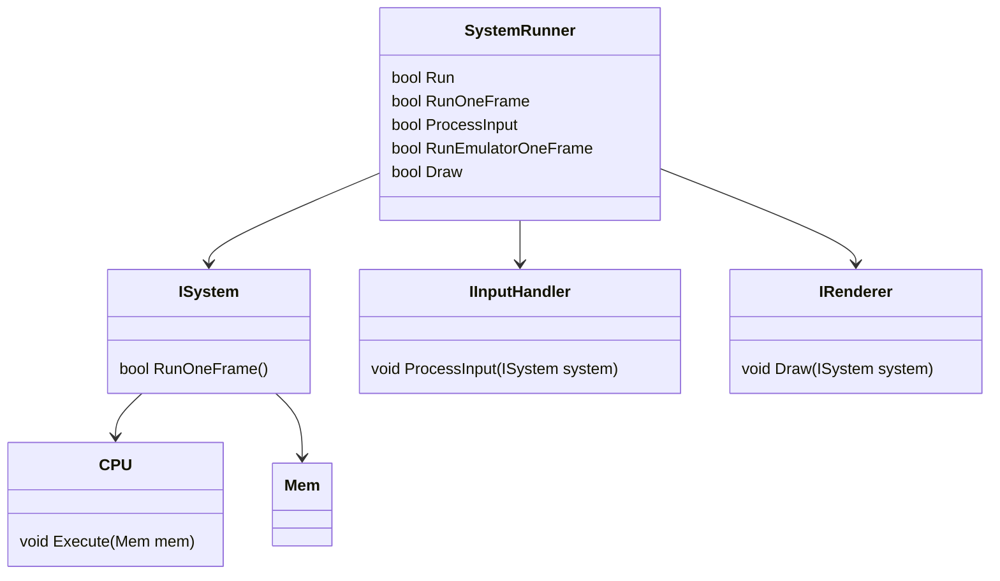

```mermaid
classDiagram
SystemRunner --> ISystem
SystemRunner --> IInputHandler
SystemRunner --> IRenderer
SystemRunner : bool Run
SystemRunner : bool RunOneFrame
SystemRunner : bool ProcessInput
SystemRunner : bool RunEmulatorOneFrame
SystemRunner : bool Draw

ISystem --> CPU
ISystem --> Mem
ISystem : bool RunOneFrame()

CPU : void Execute(Mem mem)

IRenderer : void Draw(ISystem system)

IInputHandler : void ProcessInput(ISystem system)

```