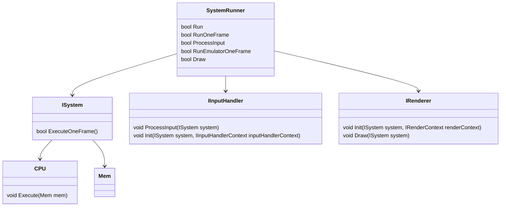
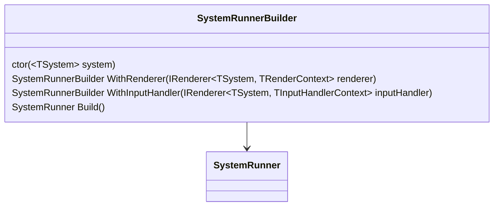

```mermaid
classDiagram
SystemRunner
SystemRunner --> ISystem
SystemRunner --> IInputHandler
SystemRunner --> IRenderer
SystemRunner : bool Run
SystemRunner : bool RunOneFrame
SystemRunner : bool ProcessInput
SystemRunner : bool RunEmulatorOneFrame
SystemRunner : bool Draw

ISystem
ISystem --> CPU
ISystem --> Mem
ISystem : bool ExecuteOneFrame()

CPU
CPU : void Execute(Mem mem)

IRenderer
IRenderer : void Init(ISystem system, IRenderContext renderContext)
IRenderer : void Draw(ISystem system)

IInputHandler
IInputHandler : void ProcessInput(ISystem system)
IInputHandler : void Init(ISystem system, IInputHandlerContext inputHandlerContext)
```

```mermaid
classDiagram
SystemRunnerBuilder
SystemRunnerBuilder --> SystemRunner
SystemRunnerBuilder : ctor(~TSystem~ system)
SystemRunnerBuilder : SystemRunnerBuilder WithRenderer(IRenderer~TSystem, TRenderContext~ renderer)
SystemRunnerBuilder : SystemRunnerBuilder WithInputHandler(IRenderer~TSystem, TInputHandlerContext~ inputHandler)
SystemRunnerBuilder : SystemRunner Build()

SystemRunner
```

