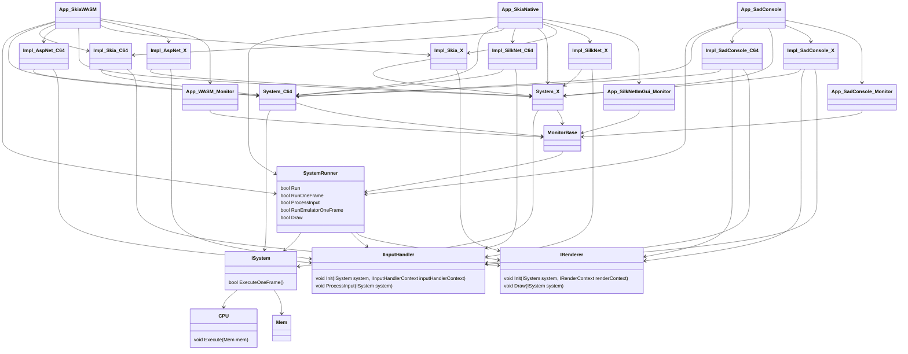
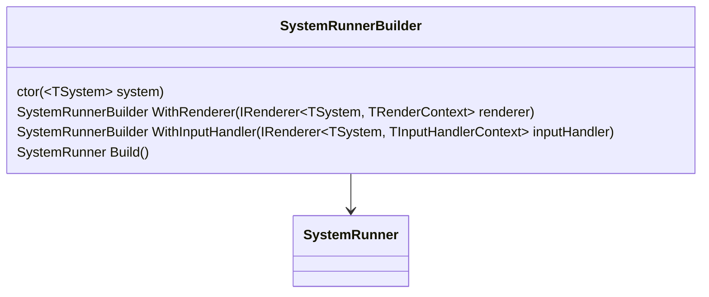

```mermaid
classDiagram

App_SkiaWASM
App_SkiaWASM --> SystemRunner
App_SkiaWASM --> System_C64
App_SkiaWASM --> Impl_Skia_C64
App_SkiaWASM --> Impl_AspNet_C64
App_SkiaWASM --> System_X
App_SkiaWASM --> Impl_Skia_X
App_SkiaWASM --> Impl_AspNet_X
App_SkiaWASM --> App_WASM_Monitor
App_WASM_Monitor --> MonitorBase

App_SkiaNative
App_SkiaNative --> SystemRunner
App_SkiaNative --> System_C64
App_SkiaNative --> Impl_Skia_C64
App_SkiaNative --> Impl_SilkNet_C64
App_SkiaNative --> System_X
App_SkiaNative --> Impl_Skia_X
App_SkiaNative --> Impl_SilkNet_X
App_SkiaNative --> App_SilkNetImGui_Monitor
App_SilkNetImGui_Monitor --> MonitorBase

App_SadConsole
App_SadConsole --> SystemRunner
App_SadConsole --> System_C64
App_SadConsole --> Impl_SadConsole_C64
App_SadConsole --> System_X
App_SadConsole --> Impl_SadConsole_X
App_SadConsole --> App_SadConsole_Monitor
App_SadConsole_Monitor --> MonitorBase

Impl_Skia_C64
Impl_Skia_C64 --> System_C64
Impl_Skia_C64 --> IRenderer

Impl_Skia_X
Impl_Skia_X --> System_X
Impl_Skia_X --> IRenderer

Impl_SilkNet_C64
Impl_SilkNet_C64 --> System_C64
Impl_SilkNet_C64 --> IInputHandler

Impl_SilkNet_X
Impl_SilkNet_X --> System_X
Impl_SilkNet_X --> IInputHandler

Impl_AspNet_C64
Impl_AspNet_C64 --> System_C64
Impl_AspNet_C64 --> IInputHandler

Impl_AspNet_X
Impl_AspNet_X --> System_X
Impl_AspNet_X --> IInputHandler

Impl_SadConsole_C64
Impl_SadConsole_C64 --> System_C64
Impl_SadConsole_C64 --> IRenderer
Impl_SadConsole_C64 --> IInputHandler

Impl_SadConsole_X
Impl_SadConsole_X --> System_X
Impl_SadConsole_X --> IRenderer
Impl_SadConsole_X --> IInputHandler

System_C64
System_C64 --> ISystem
System_C64 --> MonitorBase

System_X
System_X --> ISystem
System_X --> MonitorBase

MonitorBase
MonitorBase --> SystemRunner

SystemRunner
SystemRunner --> ISystem
SystemRunner --> IInputHandler
SystemRunner --> IRenderer
SystemRunner : bool Run
SystemRunner : bool RunOneFrame
SystemRunner : bool ProcessInput
SystemRunner : bool RunEmulatorOneFrame
SystemRunner : bool Draw

ISystem
ISystem --> CPU
ISystem --> Mem
ISystem : bool ExecuteOneFrame()

CPU
CPU : void Execute(Mem mem)

IRenderer
IRenderer : void Init(ISystem system, IRenderContext renderContext)
IRenderer : void Draw(ISystem system)

IInputHandler
IInputHandler : void Init(ISystem system, IInputHandlerContext inputHandlerContext)
IInputHandler : void ProcessInput(ISystem system)
```

```mermaid
classDiagram
SystemRunnerBuilder
SystemRunnerBuilder --> SystemRunner
SystemRunnerBuilder : ctor(~TSystem~ system)
SystemRunnerBuilder : SystemRunnerBuilder WithRenderer(IRenderer~TSystem, TRenderContext~ renderer)
SystemRunnerBuilder : SystemRunnerBuilder WithInputHandler(IRenderer~TSystem, TInputHandlerContext~ inputHandler)
SystemRunnerBuilder : SystemRunner Build()

SystemRunner
```

