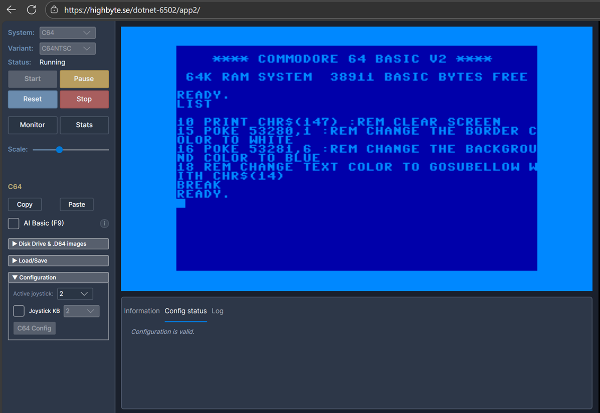
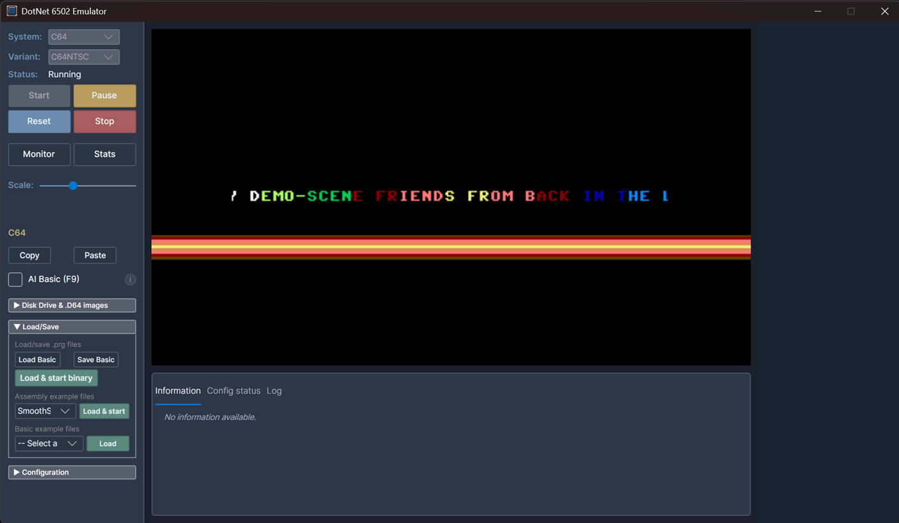
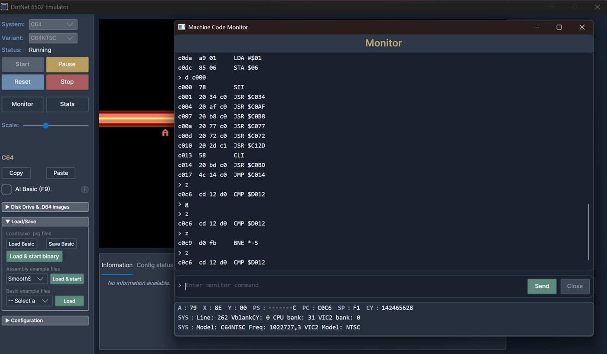

<h1 align="center">Highbyte.DotNet6502.App.Avalonia.Browser and Desktop</h1>

# Overview
Cross-platform apps (desktop and web) written with [Avalonia UI](https://avaloniaui.net/). The two apps share almost all code including UI.

## Browser app
 

Technologies
  - UI: `Avalonia` UI controls.
  - Rendering: `Highbyte.DotNet6502.Impl.Avalonia`.
  - Input: `Highbyte.DotNet6502.Impl.Avalonia`.
  - Audio: `Highbyte.DotNet6502.Impl.NAudio`. Synthesizer via `NAudio` and playback via `OpenAL`

Live version: <a href="https://highbyte.se/dotnet-6502/app2" target="_blank">https://highbyte.se/dotnet-6502/app2</a>

## Desktop app

  

Technologies
  - UI: `Avalonia` UI controls.
  - Rendering: `Highbyte.DotNet6502.Impl.Avalonia`.
  - Input: `Highbyte.DotNet6502.Impl.Avalonia`.
  - Audio: `Highbyte.DotNet6502.Impl.NAudio`. Synthesizer via `NAudio` and playback via `WebAudio JS interop`.

See [here](DESKTOP_APPS.md) how to download and run pre-built executables.

# Features

## System: C64 
- Via C64 config UI you have to upload binaries for the ROMs that a C64 uses (Kernal, Basic, Chargen). Or use a convenient auto-download functionality (with a license notice).

- Renderer provider `Rasterizer` -> target `Avalonia 2-layer bitmap`
  - Character mode (normal and multi-color).
  - Bitmap mode (normal and bitmap mode).
  - Sprites (normal and multi-color).
  - Rendering of raster lines for border and background colors.

- Renderer provider `Video commands` -> target `Skia commands`
  - Character mode (normal).

- Input using `Avalonia`

- Audio via [NAudio](https://github.com/naudio/NAudio) synthesizer.

## System: Generic computer 
The example 6502 machine code that is loaded and run by default for the _Generic_ computer is this a assembled version of [this 6502 assembly code](../samples/Assembler/Generic/hostinteraction_scroll_text_and_cycle_colors.asm)


## UI

### Menu
Start and stop of selected system.

Configuration options of selected system.

### Monitor
A Avalonia implementation of the [machine code monitor](MONITOR.md) is available by pressing F12.

### Stats
A toggleable stats window by pressing F11.

# How to run locally for development
For development system requirements, see details [here](DEVELOP.md#Requirements)

## Desktop app prerequisites, compatibility, and troubleshooting
See [here](APPS_AVALONIA_TROUBLESHOOT.md) for desktop app.

## Visual Studio 2026 or 2022 (Windows)
Open solution `dotnet-6502.sln`.
Set project `Highbyte.DotNet6502.App.Avalonia.Desktop` or `Highbyte.DotNet6502.App.Avalonia.Browser` as startup, and start with F5.

> [!IMPORTANT]  
> Running a Debug build of the Avalonia `Browser` app is very slow. To get acceptable performance a published release build with AOT is required. The `Desktop` app has ok performance in Debug mode, so using the Desktop app when developing and testing locally is recommended.

## VSCode

TODO

## Run browser app from command line (Windows, Linux, Mac)
### Run Debug build (very slow)
```shell
cd ./src/apps/Avalonia/Highbyte.DotNet6502.App.Browser
dotnet run
```
Open browser at http://localhost:5000.

### Run optimized Publish build (AOT)

To serve the published build the below example uses the DotNet global tool "serve", install with `dotnet tool install --global dotnet-serve`.

```powershell 
cd ./src/apps/Avalonia/Highbyte.DotNet6502.App.Avalonia.Browser
if(Test-Path ./bin/Publish/ ) { del ./bin/Publish/ -r -force }
dotnet publish -c Release -o ./bin/Publish/
dotnet serve -o:/ --directory ./bin/Publish/wwwroot/
```

A browser is automatically opened.
