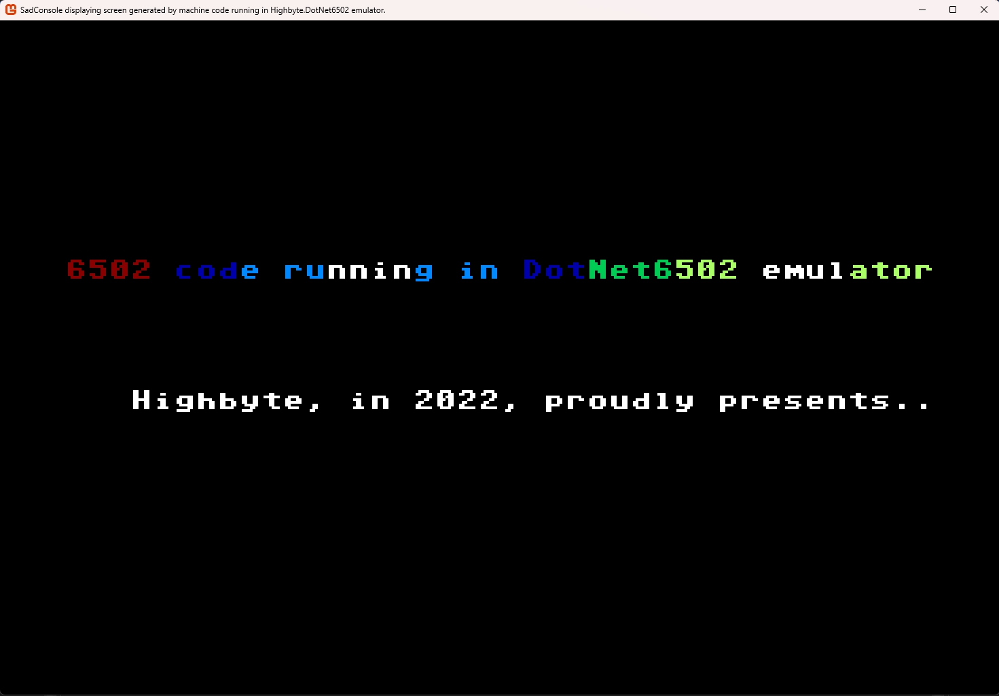

<h1 align="center">Highbyte.DotNet6502.App.SadConsole</h1>

# Overview


# Features
Native cross-platform app written in .NET with a Window, renderer, and input handler via SadConsole (from ```Highbyte.DotNet6502.Impl.SadConsole```). 

Currently the system to emulate is configured in the appsettings.json file.

# System: C64 
A directory containing the C64 ROM files (Kernal, Basic, Chargen) is supplied by the user, and set in the appsettings.json file.

# System: Generic computer 
TODO

# Monitor
TODO
