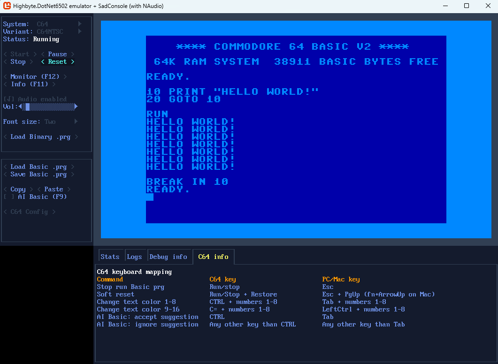

<h1 align="center">Highbyte.DotNet6502.App.SadConsole</h1>

# Overview
 

# Features
Native cross-platform app based on the [`SadConsole`](https://github.com/Thraka/SadConsole) terminal/ascii/console/game engine.

### Prerequisites, compatibility, and troubleshooting
See [here](APPS_SADCONSOLE_TROUBLESHOOT.md)

# System: C64 
- A directory containing the C64 ROM files (Kernal, Basic, Chargen) is supplied by the user. Defaults are set in the appsettings.json file, and possible to change in the UI. Also a auto-download option exists (license required).

- Renderer provider `Video commands` -> target `Skia commands`
  - Character mode (normal).
  - Only video mode that works in C64 character mode (not multicolor) with built-in characters set from ROM is supported. 

- Audio via `NAudio`
  - [NAudio](https://github.com/naudio/NAudio) + custom OpenAL (Silk.NET) provider for cross platform compatibility.

# System: Generic computer 
TODO

# Monitor
Press button or toggle with F12.
TODO

# Stats
Press button or toggle with F11.
TODO
