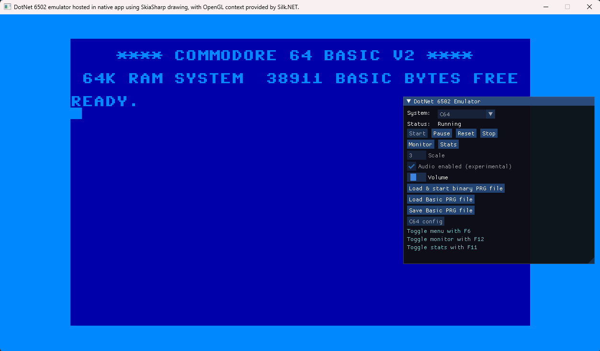

<h1 align="center">Highbyte.DotNet6502.App.SilkNetNative</h1>

# Overview



# Features
Native cross-platform app written in .NET with a Window from Silk.NET, using a SkiaSharp renderer (from ```Highbyte.DotNet6502.Impl.Skia```) and a Silk.NET input handler (from ```Highbyte.DotNet6502.Impl.SilkNet```).

Uses Silk.NET [ImGui extensions](https://www.nuget.org/packages/Silk.NET.OpenGL.Extensions.ImGui/) to render UI for interactive menu, monitor, and stats window.

# System: C64 
A directory containing the C64 ROM files (Kernal, Basic, Chargen) is supplied by the user, and set in the appsettings.json file.

Rendering of raster lines for border and background colors. 

Generation of sound via NAudio with custom OpenAL (Silk.NET) provider (for cross platform compatibility).

# System: Generic computer 
TODO

# UI

## Menu
A togglebale main menu by pressing F6.

Start and stop of selected system.

Configuration options of selected system.

## Monitor
A togglebale machine code monitor window by pressing F12.

## Stats
A togglebale stats window by pressing F11.
