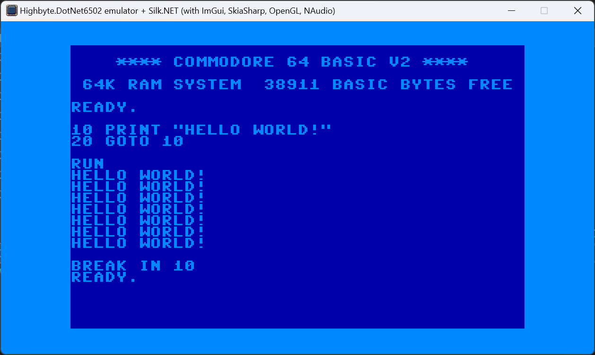

<h1 align="center">Highbyte.DotNet6502.App.SilkNetNative</h1>

# Overview
  

# Features
Native cross-platform app written in .NET using a [Silk.NET](https://github.com/dotnet/Silk.NET) window.

Uses Silk.NET [ImGui extensions](https://www.nuget.org/packages/Silk.NET.OpenGL.Extensions.ImGui/) to render UI for interactive menu, monitor, and stats window.

## Prerequisites - Linux

Using the Silk.NET + SkiaSharp + ImGui NuGet packages (that this app does) requires a GPU with OpenGL drivers installed.

### WSLg (Ubuntu) under Windows

Tested on Windows 11 in WSLg using Ubuntu 22.04.5 LTS.

```bash
sudo apt install mesa-utils
sudo apt install libwayland-client0 libwayland-cursor0 libwayland-egl1 libxkbcommon0
```

### Running in Linux VM
Not been able to test it. Requires a HyperVisor that supports GPU passthrough. Then it should probably be possible.

# System: C64 
- A directory containing the C64 ROM files (Kernal, Basic, Chargen) is supplied by the user. Defaults are set in the appsettings.json file, and possible to change in the UI.

- Renderer provider `Rasterizer` -> target `Skia 2-layer canvas`
  - Character mode (normal and multi-color).
  - Bitmap mode (normal and bitmap mode).
  - Sprites (normal and multi-color).
  - Rendering of raster lines for border and background colors.

- Renderer provider `Custom` -> target `Skia legacy v1`
  - Character mode (normal and multi-color).
  - Pre-rendered images for each character.
  - Sprites (normal and multi-color).
  - Rendering of raster lines for border and background colors.

- Renderer provider `Custom` -> target `Skia legacy v2`
  - Character mode (normal and multi-color).
  - Bitmap mode (normal and bitmap mode).
  - Sprites (normal and multi-color).
  - Rendering of raster lines for border and background colors.

- Renderer provider `Video commands` -> target `Skia commands`
  - Character mode (normal).

- Renderer provider `Custom GPU packet` -> target `SilkNet OpenGL`
  - Character mode (normal and multi-color).
  - Bitmap mode (normal and bitmap mode).
  - Sprites (normal and multi-color).
  - Rendering of raster lines for border and background colors.


- Renderers using either `SkiaSharp` or `SilkNet` (OpenGl)
  - Character mode (normal and multi-color) with all renderers
  - Bitmap mode (normal and bitmap mode) with the SkiaSharp2* and SilkNetOpenGL renderers.
  - Sprites (normal and multi-color) with all renderers.
  - Rendering of raster lines for border and background colors with all renderers.

- Input using `SilkNet`

- Audio via `NAudio`
  - [NAudio](https://github.com/naudio/NAudio) + custom OpenAL (Silk.NET) provider for cross platform compatibility.

# System: Generic computer 
TODO

# UI

## Menu
A toggleable main menu by pressing F6.

Start and stop of selected system.

Configuration options of selected system.

   ## Monitor
A toggleable machine code monitor window by pressing F12.

## Stats
A toggleable stats window by pressing F11.
