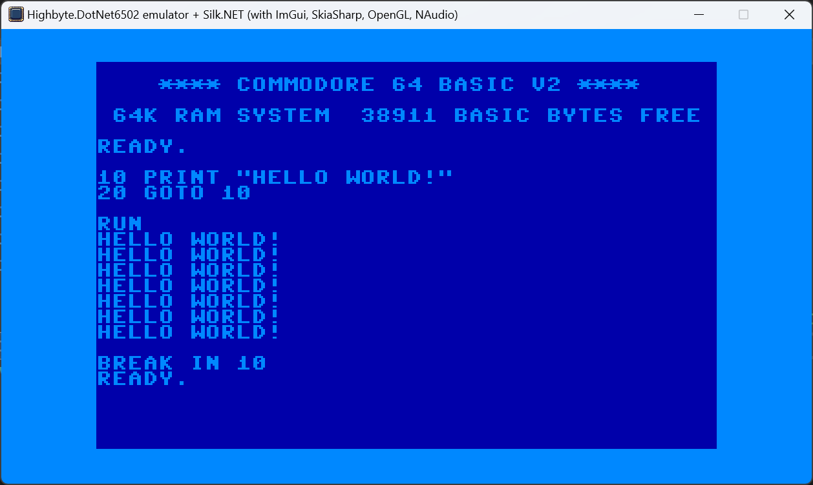
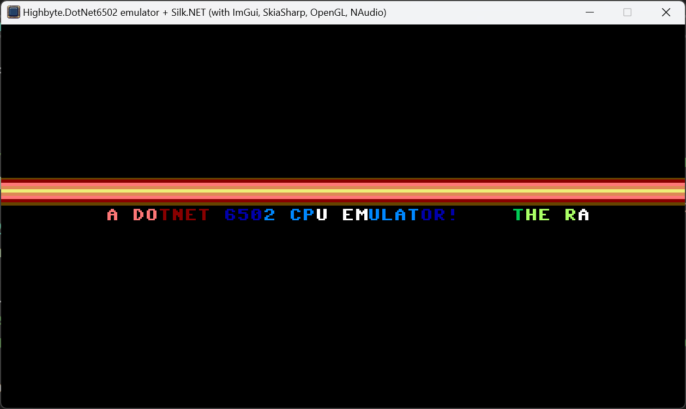

<h1 align="center">Highbyte.DotNet6502.App.SilkNetNative</h1>

# Overview
Cross-platform desktop app written in .NET using [Silk.NET](https://github.com/dotnet/Silk.NET).

   target `Skia 2-layer canvas`
  - Character mode (normal and multi-color).
  - Bitmap mode (normal and bitmap mode).
  - Sprites (normal and multi-color).
  - Rendering of raster lines for border and background colors.

- Renderer provider `Custom` -> target `Skia legacy v1`
  - Character mode (normal and multi-color).
  - Pre-rendered images for each character.
  - Sprites (normal and multi-color).
  - Rendering of raster lines for border and background colors.

- Renderer provider `Custom` -> target `Skia legacy v2`
  - Character mode (normal and multi-color).
  - Bitmap mode (normal and bitmap mode).
  - Sprites (normal and multi-color).
  - Rendering of raster lines for border and background colors.

- Renderer provider `Video commands` -> target `Skia commands`
  - Character mode (normal).

- Renderer provider `Custom GPU packet` -> target `SilkNet OpenGL`
  - Character mode (normal and multi-color).
  - Bitmap mode (normal and bitmap mode).
  - Sprites (normal and multi-color).
  - Rendering of raster lines for border and background colors.

- Renderers using either `SkiaSharp` or `SilkNet` (OpenGl)
  - Character mode (normal and multi-color) with all renderers
  - Bitmap mode (normal and bitmap mode) with the SkiaSharp2* and SilkNetOpenGL renderers.
  - Sprites (normal and multi-color) with all renderers.
  - Rendering of raster lines for border and background colors with all renderers.

- Input using `SilkNet`

- Audio via [NAudio](https://github.com/naudio/NAudio) synthesizer.

## System: Generic computer 
TODO

## UI

### Menu
A toggleable main menu by pressing F6.

Start and stop of selected system.

Configuration options of selected system.

### Monitor
A toggleable machine code monitor window by pressing F12.

### Stats
A toggleable stats window by pressing F11.

# How to run locally for development
For development system requirements, see details [here](DEVELOP.md#Requirements)

## Prerequisites, compatibility, and troubleshooting
See [here](APPS_SILKNET_NATIVE_TROUBLESHOOT.md)

## Visual Studio 2026 or 2022 (Windows)
Open solution `dotnet-6502.sln`.
Set project `Highbyte.DotNet6502.App.SilkNetNative`as startup, and start with F5.

## VSCode

TODO
