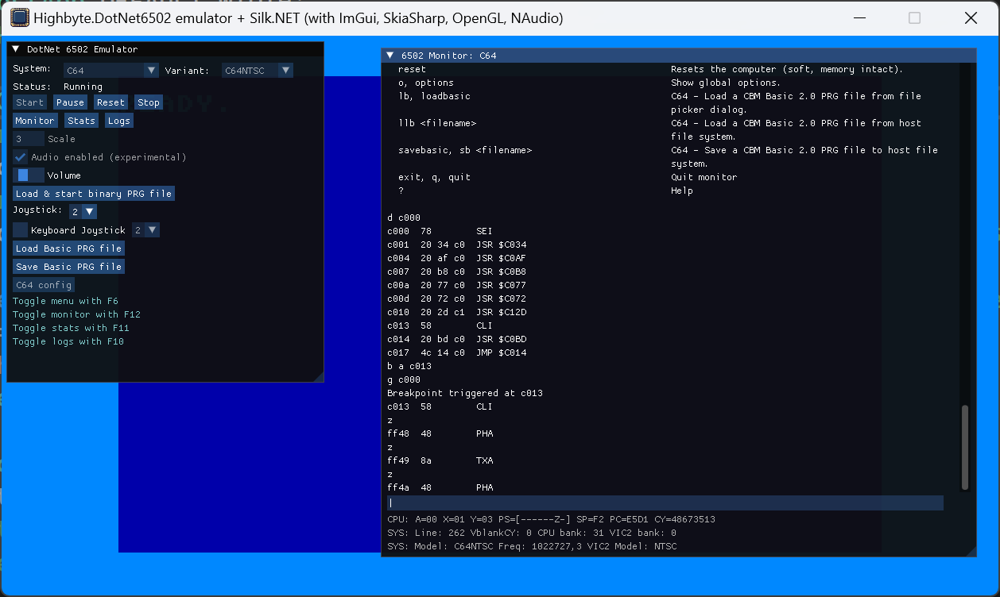

<h1 align="center">Highbyte.DotNet6502.App.SilkNetNative</h1>

# Overview
  

# Features
Native cross-platform app written in .NET using a [Silk.NET](https://github.com/dotnet/Silk.NET) window.

Uses Silk.NET [ImGui extensions](https://www.nuget.org/packages/Silk.NET.OpenGL.Extensions.ImGui/) to render UI for interactive menu, monitor, and stats window.

# System: C64 
- A directory containing the C64 ROM files (Kernal, Basic, Chargen) is supplied by the user. Defaults are set in the appsettings.json file, and possible to change in the UI.

- Renderers using either `SkiaSharp` or `SilkNet` (OpenGl)
  - Character mode (normal and multi-color) with all renderers
  - Bitmap mode (normal and bitmap mode) with the SkiaSharp2* and SilkNetOpenGL renderers.
  - Sprites (normal and multi-color) with all renderers.
  - Rendering of raster lines for border and background colors with all renderers.

- Input using `SilkNet`

- Audio via `NAudio`
  - [NAudio](https://github.com/naudio/NAudio) + custom OpenAL (Silk.NET) provider for cross platform compatibility.

# System: Generic computer 
TODO

# UI

## Menu
A togglebale main menu by pressing F6.

Start and stop of selected system.

Configuration options of selected system.

   ## Monitor
A togglebale machine code monitor window by pressing F12.

## Stats
A togglebale stats window by pressing F11.
