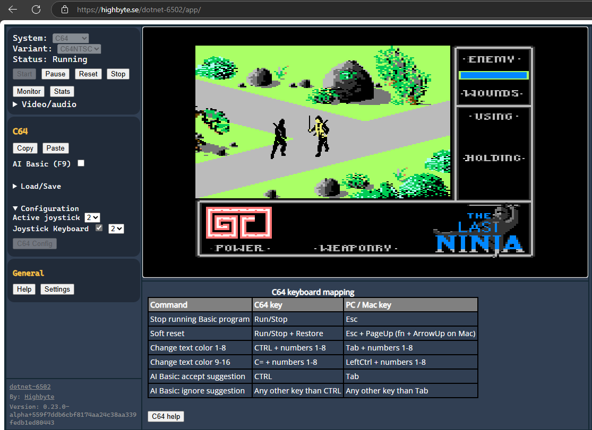

<h1 align="center">Highbyte.DotNet6502.App.WASM</h1>

# Overview
 

A deployed version can be found here [https://highbyte.se/dotnet-6502/app](https://highbyte.se/dotnet-6502/app)

# Features
A web app written in Blazor WASM (Web Assembly), using [`SkiaSharp.Views.Blazor`](https://www.nuget.org/packages/SkiaSharp.Views.Blazor) library to provide a Canvas for drawing on with main [`SkiaSharp`](https://www.nuget.org/packages/SkiaSharp) library.

# System: C64 
- Via C64 config UI you have to upload binaries for the ROMs that a C64 uses (Kernal, Basic, Chargen).

- Renderers: `SkiaSharp`, `SkiaSharp2`, `SkiaSharp2b`
  - Character mode (normal and multi-color) with all renderers
  - Bitmap mode (normal and bitmap mode) only with the `SkiaSharp2*` renderers.
  - Sprites (normal and multi-color) with all renderers.
  - Rendering of raster lines for border and background colors with all renderers.

- Input using `AspNet`

- Audio via `AspNet`
  - Using .NET interop to WebAudio API

# System: Generic computer 
The example 6502 machine code that is loaded and run by default for the _Generic_ computer is this a assembled version of [this 6502 assembly code](../samples/Assembler/Generic/hostinteraction_scroll_text_and_cycle_colors.asm)


# UI

## Menu
Start and stop of selected system.

Configuration options of selected system.

## Monitor
A Blazor WASM implementation of the [machine code monitor](MONITOR.md) is available by pressing F12.

## Stats
A togglebale stats window by pressing F11.

# How to run locally

For system requirements, see details [here](DEVELOP.md#Requirements)

## Visual Studio 2022 (Windows)

Open solution `dotnet-6502.sln`.
Set project `Highbyte.DotNet6502.App.WASM` as startup, and start with F5.

## From command line (Windows, Linux, Mac)
### Run Debug build
``` 
cd ./src/apps/Highbyte.DotNet6502.App.WASM
dotnet run
```
Open browser at http://localhost:5000.

### Run optimized Publish build
Requires 
- DotNet workload "wasm-tools" , install with `dotnet workload install wasm-tools`
- DotNet global tool "serve", install with `dotnet tool install --global dotnet-serve`

```powershell 
cd ./src/apps/Highbyte.DotNet6502.App.WASM
if(Test-Path $publishDir) { del ./bin/Publish/ -r -force }
dotnet publish -c Release -o ./bin/Publish/
dotnet serve -o:$path --directory ./bin/Publish/wwwroot/
```
A browser is automatically opened.
