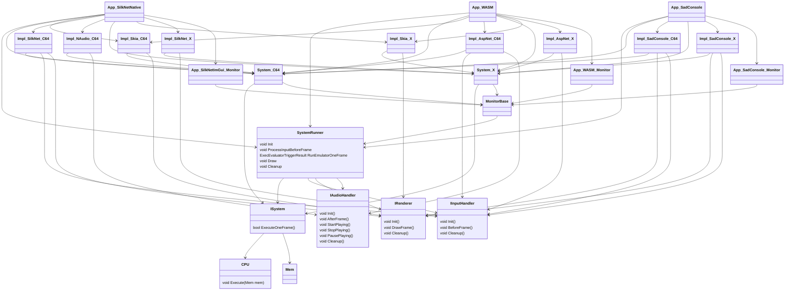

```mermaid
classDiagram

App_WASM
App_WASM --> SystemRunner
App_WASM --> System_C64
App_WASM --> Impl_Skia_C64
App_WASM --> Impl_AspNet_C64
App_WASM --> System_X
App_WASM --> Impl_Skia_X
App_WASM --> Impl_AspNet_X
App_WASM --> App_WASM_Monitor
App_WASM_Monitor --> MonitorBase

App_SilkNetNative
App_SilkNetNative --> SystemRunner
App_SilkNetNative --> System_C64
App_SilkNetNative --> Impl_Skia_C64
App_SilkNetNative --> Impl_SilkNet_C64
App_SilkNetNative --> Impl_NAudio_C64
App_SilkNetNative --> System_X
App_SilkNetNative --> Impl_Skia_X
App_SilkNetNative --> Impl_SilkNet_X
App_SilkNetNative --> App_SilkNetImGui_Monitor
App_SilkNetImGui_Monitor --> MonitorBase

App_SadConsole
App_SadConsole --> SystemRunner
App_SadConsole --> System_C64
App_SadConsole --> Impl_SadConsole_C64
App_SadConsole --> System_X
App_SadConsole --> Impl_SadConsole_X
App_SadConsole --> App_SadConsole_Monitor
App_SadConsole_Monitor --> MonitorBase

Impl_Skia_C64
Impl_Skia_C64 --> System_C64
Impl_Skia_C64 --> IRenderer

Impl_Skia_X
Impl_Skia_X --> System_X
Impl_Skia_X --> IRenderer

Impl_SilkNet_C64
Impl_SilkNet_C64 --> System_C64
Impl_SilkNet_C64 --> IInputHandler
Impl_SilkNet_C64 --> IRenderer

Impl_SilkNet_X
Impl_SilkNet_X --> System_X
Impl_SilkNet_X --> IInputHandler

Impl_NAudio_C64
Impl_NAudio_C64 --> System_C64
Impl_NAudio_C64 --> IAudioHandler

Impl_AspNet_C64
Impl_AspNet_C64 --> System_C64
Impl_AspNet_C64 --> IInputHandler
Impl_AspNet_C64 --> IAudioHandler

Impl_AspNet_X
Impl_AspNet_X --> System_X
Impl_AspNet_X --> IInputHandler

Impl_SadConsole_C64
Impl_SadConsole_C64 --> System_C64
Impl_SadConsole_C64 --> IRenderer
Impl_SadConsole_C64 --> IInputHandler

Impl_SadConsole_X
Impl_SadConsole_X --> System_X
Impl_SadConsole_X --> IRenderer
Impl_SadConsole_X --> IInputHandler

System_C64
System_C64 --> ISystem
System_C64 --> MonitorBase

System_X
System_X --> ISystem
System_X --> MonitorBase

MonitorBase
MonitorBase --> SystemRunner

SystemRunner
SystemRunner --> ISystem
SystemRunner --> IInputHandler
SystemRunner --> IRenderer
SystemRunner --> IAudioHandler
SystemRunner : void Init
SystemRunner : void ProcessInputBeforeFrame
SystemRunner : ExecEvaluatorTriggerResult RunEmulatorOneFrame
SystemRunner : void Draw
SystemRunner : void Cleanup

ISystem
ISystem --> CPU
ISystem --> Mem
ISystem : bool ExecuteOneFrame()

CPU
CPU : void Execute(Mem mem)

IRenderer
IRenderer : void Init()
IRenderer : void DrawFrame()
IRenderer : void Cleanup()

IInputHandler
IInputHandler : void Init()
IInputHandler : void BeforeFrame()
IInputHandler : void Cleanup()

IAudioHandler
IAudioHandler : void Init()
IAudioHandler : void AfterFrame()
IAudioHandler : void StartPlaying()
IAudioHandler : void StopPlaying()
IAudioHandler : void PausePlaying()
IAudioHandler : void Cleanup()

```

