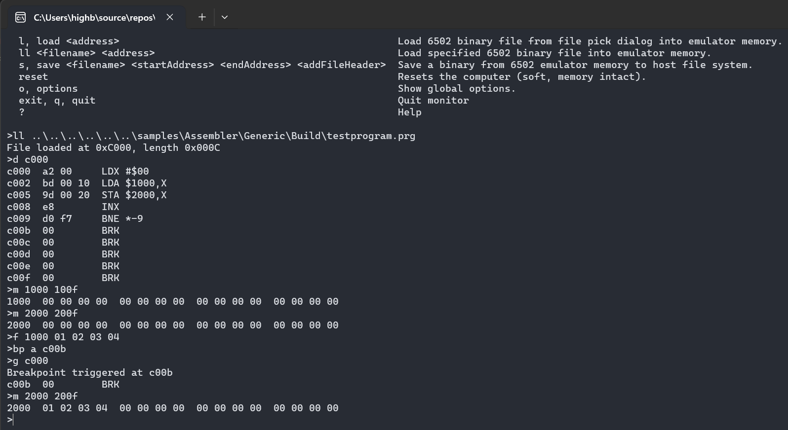

# Console Monitor app

Cross-platform desktop console application whose only UI is a machine code monitor.

{ width="25%" }

!!! note
    There is also the [VS Code debugger extension](../tools/vscode-debugger/debugging.md) that can be used for debugging both assembly source and raw disassembly. It's a lot more powerful than the built-in machine code monitor described here.

Technologies:

- UI: standard .NET console.
- Input: standard .NET console.
- Audio: none.

## Features

Stand-alone console monitor app, no other UI.

Can be used for running general 6502 code with no system-specific requirements.

!!! note
    This app is single-system *by design*. It uses a `GenericComputer` purely as the lightest
    bare-metal `ISystem` (a 6502 CPU + 64 KB RAM, no ROM, no I/O) — not as the "Generic" peer
    system. It is intentionally not routed through plugin discovery / `Impl.Headless`.
