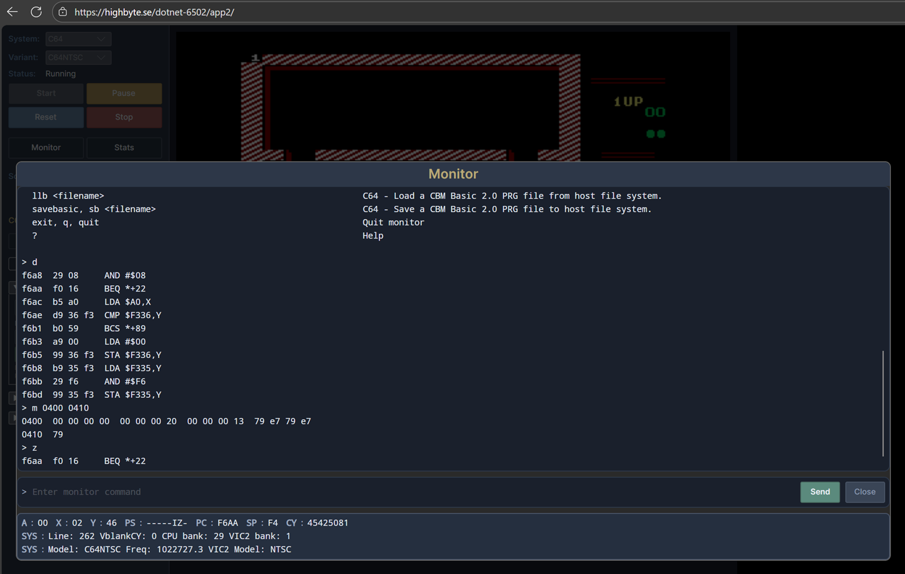

# Avalonia Browser app

## Overview

Cross-platform browser app written with [Avalonia UI](https://avaloniaui.net/). Shares almost all code (including UI) with the [Avalonia Desktop app](../../host-apps/avalonia/desktop.md).

{ width="33%" }
{ width="33%" }
{ width="33%" }

Technologies:

- UI: `Avalonia` UI controls.
- Rendering: [`Highbyte.DotNet6502.Impl.Avalonia`](../../libraries/implementation/avalonia.md).
- Input: [`Highbyte.DotNet6502.Impl.Avalonia`](../../libraries/implementation/avalonia.md) + [`Highbyte.DotNet6502.Impl.Browser`](../../libraries/implementation/browser.md) (gamepad).
- Audio: [`Highbyte.DotNet6502.Impl.NAudio`](../../libraries/implementation/naudio.md), playback via WebAudio JS interop. Two C64 audio providers available: a sample-based one (good but not perfect accuracy — the default) and a command-stream synthesizer one (low CPU but inaccurate). See [C64 audio](../../systems/c64/libraries.md#audio).

Live version: <https://highbyte.se/dotnet-6502/app2>

## Install

The browser app runs entirely in the browser — no installation required. Open the [live version](https://highbyte.se/dotnet-6502/app2) and start the emulator from the UI.

To self-host, see [Run from command line](#run-from-command-line) below.

## Features

System-specific features (ROMs, display, input, audio, SwiftLink, the C64 menu, and the
browser-only **share link**) are documented on the per-system pages — shared with the
[Avalonia Desktop app](../../host-apps/avalonia/desktop.md), with browser-specific differences
called out inline:

- [C64 in the Avalonia apps](c64.md)
- [Generic computer in the Avalonia apps](generic.md)

### Lua scripting

The browser app supports the same Lua scripting API as the Avalonia Desktop app, except for filesystem and TCP access (the browser sandbox does not allow them; the key/value store falls back to `localStorage`). For the full guide, see [Tools / Scripting](../../tools/scripting/overview.md).

## URL query parameters

--8<-- "startup-params/browser-intro.md"

--8<-- "startup-params/browser-general.md"

--8<-- "startup-params/browser-c64.md"

When a URL starts `system=C64` and the app does not yet have the required C64 ROMs, the browser startup flow prompts the user to acknowledge the ROM download terms and can download the ROMs before continuing. This lets first-run automation links work without opening the C64 config dialog first.

### Examples

```text
# Start C64 PAL and wait until the machine is ready
?system=C64&systemVariant=C64PAL&start=1&waitForSystemReady=1

# Load and run a bundled PRG
?system=C64&start=1&waitForSystemReady=1&loadPrgUrl=prg/c64/smooth_scroller_and_raster.prg&runLoadedProgram=1

# Paste BASIC source from a browser-served text file and run it
?system=C64&start=1&waitForSystemReady=1&basicUrl=basic/c64/hello-world.bas&runBasic=1

# Paste the same BASIC source inline and run it
?system=C64&start=1&waitForSystemReady=1&basicText=MTAgYzE9NzpjMj0xNAoyMCBjPWMxCjMwIGlmIGM9YzEgdGhlbiBjPWMyIDogZ290byA1MAo0MCBpZiBjPWMyIHRoZW4gYz1jMQo1MCBwb2tlIDUzMjgwLGMKNjAgcHJpbnQgImhlbGxvIHdvcmxkISIKNzAgZm9yIGk9MSB0byAxNTA6bmV4dAo4MCBnb3RvIDMwCg&runBasic=1

# Mount a .d64 in drive 8, paste LOAD"*",8,1 + RUN, keyboard-joystick on port 2
?system=C64&systemVariant=C64PAL&start=1&waitForSystemReady=1&loadD64Url=d64%2Fgiana-sisters.d64&diskMount=1&runLoadedProgram=1&keyboardJoystickEnabled=1&keyboardJoystickNumber=2

# Direct-load the first PRG from a .d64 (no disk mount) and RUN it
?system=C64&start=1&waitForSystemReady=1&loadD64Url=d64%2Fgiana-sisters.d64&d64Program=*&runLoadedProgram=1

# Direct-load the first PRG from a selected .d64 inside a ZIP archive
?system=C64&start=1&waitForSystemReady=1&loadD64Url=archives%2Fgames.zip&loadD64ZipEntry=side-b%2Fgiana-sisters.d64&d64Program=*&runLoadedProgram=1

# Attach a .crt cartridge image
?system=C64&start=1&loadCrtUrl=crt%2Ffc3.crt

# Attach a selected .crt inside a ZIP archive
?system=C64&start=1&loadCrtUrl=archives%2Fcarts.zip&loadCrtZipEntry=carts%2Ffc3.crt

# Start C64 with keyboard-joystick on port 2 and audio disabled (no .d64, no PRG)
?system=C64&start=1&waitForSystemReady=1&keyboardJoystickEnabled=1&keyboardJoystickNumber=2&audioEnabled=false

# Run an inline Lua script (base64url for: log.info('hello'))
?script=bG9nLmluZm8oJ2hlbGxvJyk

# Run a Lua script fetched over HTTP
?scriptUrl=scripts/example_emulator_control.lua

# Restore an emulator-state snapshot (machine is left paused after restore)
?loadSnapshotUrl=snapshots%2Fc64-game.d6502snap

# Restore a snapshot and resume running it
?loadSnapshotUrl=snapshots%2Fc64-game.d6502snap&start=1
```

The browser app ships the `basicUrl` sample above as `basic/c64/hello-world.bas`, containing:

```basic
10 c1=7:c2=14
20 c=c1
30 if c=c1 then c=c2 : goto 50
40 if c=c2 then c=c1
50 poke 53280,c
60 print "hello world!"
70 for i=1 to 150:next
80 goto 30
```

### Important differences from desktop automation

- `loadPrgUrl`, `basicUrl`, `loadD64Url`, `loadCrtUrl`, `loadSnapshotUrl`, and `scriptUrl` use browser HTTP fetch semantics, so normal browser origin and CORS rules apply. The desktop app reads its load sources from the local filesystem (`--loadPrg` / `--loadD64` / `--loadCrt` / `--basicFile` / `--load-snapshot` / `--script`) and additionally offers HTTP variants (`--loadPrgUrl` / `--loadD64Url` / `--loadCrtUrl` / `--basicUrl`).
- `loadSnapshotUrl` restores a full `.d6502snap` emulator-state snapshot; the snapshot's manifest defines the machine, so it does not take a `system` parameter and is mutually exclusive with the other load sources and scripts. The machine is left paused after restore — add `start=1` to resume. Mirrors desktop `--load-snapshot`.
- `basicText` is **base64url-encoded** in the browser (it travels in a URL); the desktop `--basicText` takes plain text, and `--basicFile` reads a local file.
- `basicText` / `basicUrl` are C64-only and use the normal keyboard paste path after BASIC is ready; `runBasic=1` simply appends `RUN` and Return after the pasted source.
- `loadD64Url` is fetched **after** the C64 has booted to BASIC ready, so a slow remote `.d64` shows progress as a visible BASIC prompt rather than a blank Avalonia page. The desktop equivalents (`--loadD64 <path>` local, `--loadD64Url <url>`) read from the filesystem or HTTP respectively. If the URL points at a ZIP archive, `loadD64ZipEntry` can select an exact `.d64`; otherwise the first `.d64` entry is used.
- `loadCrtUrl` does **not** require `waitForSystemReady`; attaching the cartridge resets / boots the C64 into the cartridge. The URL may point at a raw `.crt`, at a ZIP archive containing exactly one `.crt`, or at a ZIP archive with an exact `.crt` selected by `loadCrtZipEntry`.
- URL-driven Lua is **disabled by default**. Enable **Allow URL-driven scripts (script / scriptUrl query params)** in the browser app's general settings, save, then reload the page.
- URL-driven scripts do not behave exactly like desktop `--script`: the browser app still selects the configured default system first, then enables the injected script. The script can still take over by calling APIs such as `emu.select(...)` and `emu.start()`.

## How to run locally for development

For development system requirements, see [Development](../../home/development.md).

### Visual Studio (Windows)

Open solution `dotnet-6502.slnx`. Set project `Highbyte.DotNet6502.App.Avalonia.Browser` as startup, and start with F5.

!!! important
    Running a Debug build of the Avalonia Browser app is very slow. To get acceptable performance a published release build with AOT is required. The Avalonia Desktop app has ok performance in Debug mode, so using the Desktop app when developing and testing locally is recommended.

### Run from command line

#### Run Debug build (very slow)

```sh
cd ./src/apps/Avalonia/Highbyte.DotNet6502.App.Avalonia.Browser
dotnet run
```

Open browser at <http://localhost:5000>.

#### Run optimized Publish build (AOT)

To serve the published build, the example below uses the .NET global tool `dotnet-serve`. Install with `dotnet tool install --global dotnet-serve`.

If you want to test the lower-latency browser SID sample modes locally (`DirectWriteAuto` /
`DirectWriteAudioWorklet`), the static host must return these headers on the app responses:

- `Cross-Origin-Opener-Policy: same-origin`
- `Cross-Origin-Embedder-Policy: require-corp`

Those headers let the page become `crossOriginIsolated`, which is required for
`SharedArrayBuffer` and the AudioWorklet shared-ring path used by the low-latency mode.

PowerShell:

```powershell
cd ./src/apps/Avalonia/Highbyte.DotNet6502.App.Avalonia.Browser
if(Test-Path ./bin/Publish/) { del ./bin/Publish/ -r -force }
dotnet publish -c Release -o ./bin/Publish/
dotnet serve -p 5001 -o:/ --directory ./bin/Publish/wwwroot/ `
  -h "Cross-Origin-Opener-Policy: same-origin" `
  -h "Cross-Origin-Embedder-Policy: require-corp"
```

macOS / Linux:

```sh
cd ./src/apps/Avalonia/Highbyte.DotNet6502.App.Avalonia.Browser
rm -rf ./bin/Publish/
dotnet publish -c Release -o ./bin/Publish/
dotnet serve -p 5001 -o:/ --directory ./bin/Publish/wwwroot/ \
  -h "Cross-Origin-Opener-Policy: same-origin" \
  -h "Cross-Origin-Embedder-Policy: require-corp"
```

A browser is automatically opened at <http://localhost:5001>.

### Deployed site headers (Cloudflare)

The live site (<https://highbyte.se/dotnet-6502/app2>) is served from GitHub Pages
behind Cloudflare. GitHub Pages cannot set arbitrary response headers, so the same
`Cross-Origin-Opener-Policy` / `Cross-Origin-Embedder-Policy` headers are injected at
the Cloudflare edge by a small Worker scoped to the emulator app paths
(`/dotnet-6502/app*`), leaving the docs site unaffected.

The Worker source and its deploy / verify steps live in
[`tools/cloudflare/app-sec-headers/`](https://github.com/highbyte/dotnet-6502/tree/master/tools/cloudflare/app-sec-headers).
