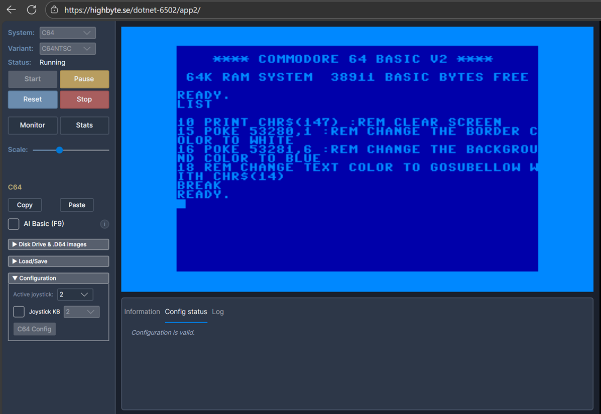
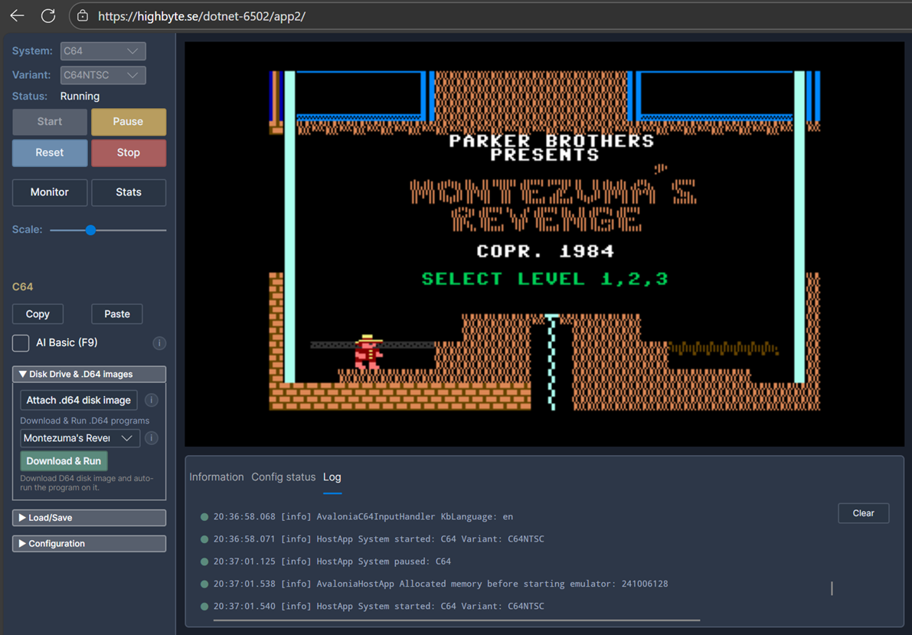
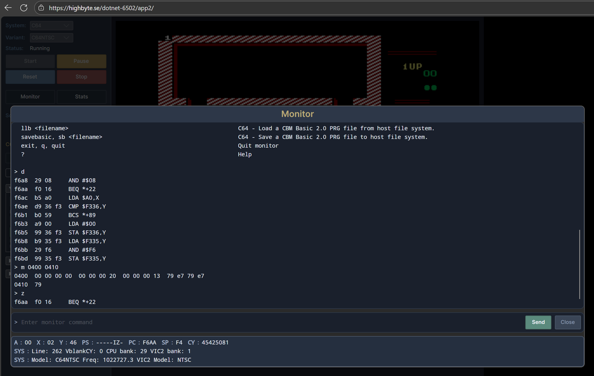
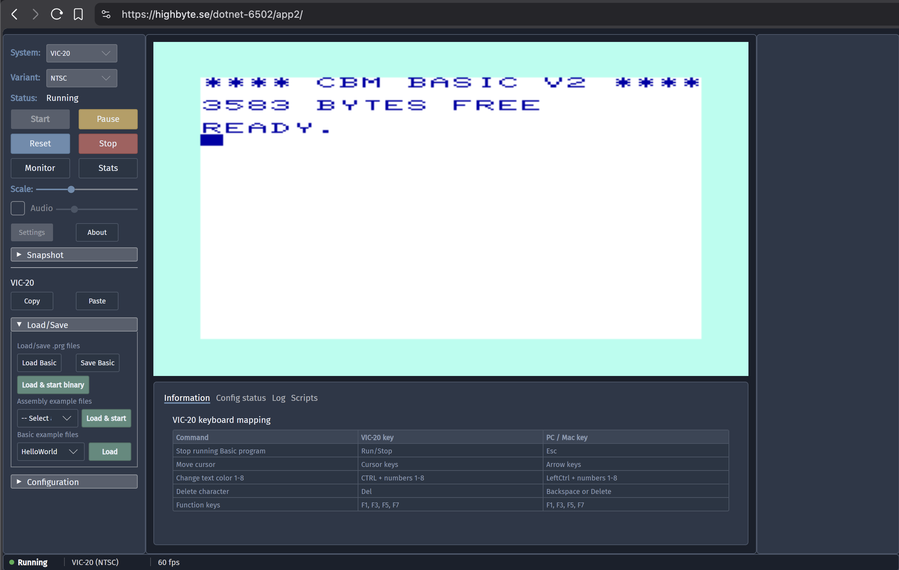
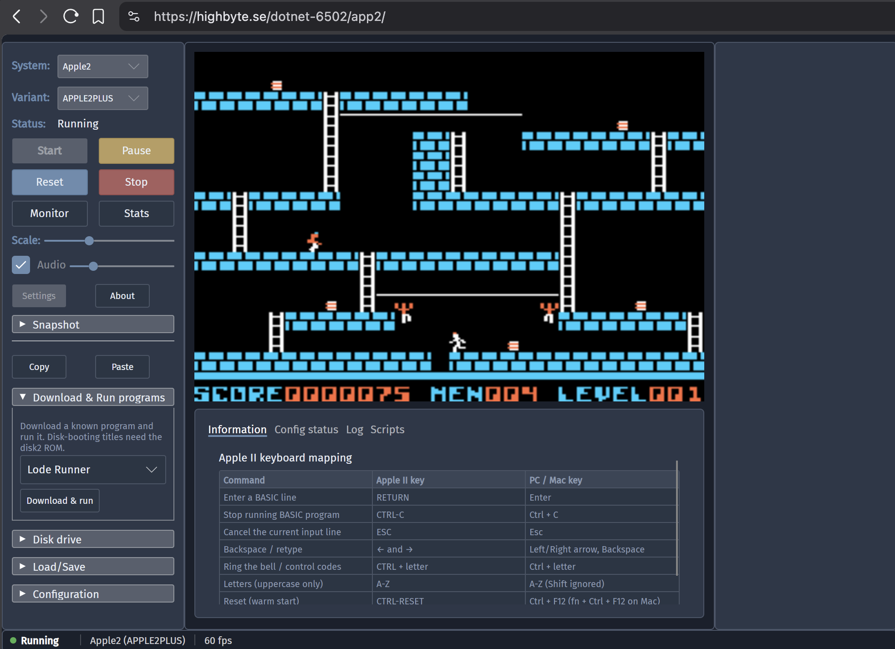

# Avalonia Browser app

## Small screens and zoom

The browser app keeps its desktop-sized Avalonia layout on narrow screens. The page can be
scrolled in both directions to reach the emulator display and controls. When the unscaled
app exceeds the browser window, floating **−**, **+**, **Fit**, and **Reset** buttons appear.
**Fit** scales the full app to the available width and height; **Reset** returns to 100%
and the top-left corner. If the app fits without scaling, it returns to 100% and the
buttons disappear unless an orientation lock is active. The controls stay hidden during startup until Avalonia reports its
content size. This adapts to the browser window dimensions on any device. The contrasting
handle stays fixed at the bottom-left in both states, pointing left to collapse the toolbar
and right to expand it.
App zoom leaves the HTML toolbar at its normal size; native browser pinch zoom remains available.
Click or tap it without changing the zoom or scroll position. The loading logo centers in the browser window.
When the scaled app overflows the window, scroll over the canvas with a mouse wheel or
trackpad, or drag on a touchscreen to pan. The Avalonia **Scale** slider
changes only the emulated display size, while the browser zoom buttons scale the whole app.
The canvas scrolls inside a panel sized to the browser window, keeping wide content from
triggering whole-page shrinking on iOS. The floating toolbar sits outside that panel;
the app's zoom buttons scale the canvas while the toolbar retains its size. Native browser
pinch zoom remains available, and repeated toolbar taps do not trigger double-tap page zoom.
The canvas grows with the Avalonia content, including larger **Scale** settings. Browser zoom
ranges from 10% to 200%; very wide content may still need horizontal scrolling at 10%.
When the scaled canvas fits, it centers in the available window area. Overlay dialogs,
including nested acknowledgments, center within the visible canvas area and update when
scrolling, zooming, or resizing. Their size is limited to that area, above the zoom toolbar.
While an overlay is open, wheel, trackpad, and touch scrolling stay inside Avalonia;
the background page does not pan. Page panning resumes after the last overlay closes.

## Screen orientation

The app keeps the device's orientation on startup. On touch devices with the orientation-lock
and fullscreen APIs, **Rotate** switches between portrait and landscape. It enters fullscreen
when needed; the button's tooltip and accessible label describe the next orientation.
Browsers can still reject the request, in which case a message explains the limitation.
On touch devices where these APIs are unavailable, including Safari and Brave on iPhone/iPad,
Rotate appears disabled. Hover, focus, or tap it for guidance to turn the device and disable
its rotation lock if needed. Availability is based on browser capabilities rather than its name.
The disabled button remains focusable and tappable to show its explanation; it cannot request rotation.
Tap Rotate again, tap outside the explanation, or press Escape to dismiss it. Tapping inside
keeps it open for reading. Help opened by tapping stays until dismissed; hover/focus help
also disappears after ten seconds.
If the API exists but reports that rotation is unsupported, Rotate stays visible but disabled
and its explanation uses the same dismissal controls, including Reset. Desktop Chromium device emulation exposes the API
without supporting orientation locking; use the device toolbar's rotate icon to test the
landscape layout. An iPhone device preset simulates its viewport, not Safari's capabilities.
Failed requests log `[DotNet6502] Orientation request failed.` in the browser console with
the request stage, browser error name, target orientation, viewport size, and fullscreen state.

**Reset** restores automatic rotation along with 100% zoom and the top-left position. It also
exits fullscreen if Rotate entered it. Exiting fullscreen through the browser releases the
orientation lock. While an orientation lock is active, the toolbar remains available even
if the app now fits, so Rotate and Reset stay reachable. Normal device rotation continues to
update the layout; Fit adjusts automatically while Fit mode is active.

## Safari compatibility

Older Safari releases have had compatibility problems. The macOS startup notice remains
as a precaution because a minimum supported Safari version has not been established;
it does not test browser capabilities or indicate that startup has failed. Successful
BASIC startup does not verify every game, audio mode, or file operation.

Download & Run uses the same CORS proxy as ROM downloads in the browser. It leaves
User-Agent selection to the browser; the custom download header is used only by the
native app when contacting sources directly.

## Browser script checks

From the repository root with Node.js 24, run:

```sh
node --test "tests/Highbyte.DotNet6502.Tests/Browser/*.test.cjs"
```

These checks execute the production zoom script with a deterministic DOM and browser API
model. They cover Fit/Reset, window and content resizing, visible dialog coordinates, modal
wheel routing, toolbar state, and orientation/fullscreen success and failure paths. They run
in both the independent build/test workflow and Sonar; the latter also imports JavaScript
coverage. Canvas rendering, pointer hit-testing, and physical screen rotation still require
verification in a real browser/device.

## Overview

Cross-platform browser app written with [Avalonia UI](https://avaloniaui.net/). Shares almost all code (including UI) with the [Avalonia Desktop app](../../host-apps/avalonia/desktop.md).

<div class="screenshot-grid" markdown="1">











</div>

Technologies:

- UI: `Avalonia` UI controls.
- Rendering: [`Highbyte.DotNet6502.Impl.Avalonia`](../../libraries/implementation/avalonia.md).
- Input: [`Highbyte.DotNet6502.Impl.Avalonia`](../../libraries/implementation/avalonia.md) + [`Highbyte.DotNet6502.Impl.Browser`](../../libraries/implementation/browser.md) (gamepad).
- Audio: [`Highbyte.DotNet6502.Impl.NAudio`](../../libraries/implementation/naudio.md), playback via WebAudio JS interop. Two C64 audio providers available: a sample-based one (good but not perfect accuracy — the default) and a command-stream synthesizer one (low CPU but inaccurate). See [C64 audio](../../systems/c64/libraries.md#audio).

Live version: <https://highbyte.se/dotnet-6502/app2>

## Install

The browser app runs entirely in the browser — no installation required. Open the [live version](https://highbyte.se/dotnet-6502/app2) and start the emulator from the UI.

To self-host, see [Run from command line](#run-from-command-line) below.

## Features

System-specific features (ROMs, display, input, audio, SwiftLink, the C64 menu, and the
browser-only **share link**) are documented on the per-system pages — shared with the
[Avalonia Desktop app](../../host-apps/avalonia/desktop.md), with browser-specific differences
called out inline:

- [C64 in the Avalonia apps](c64.md)
- [VIC-20 in the Avalonia apps](vic20.md)
- [Apple II Plus in the Avalonia apps](apple2.md)
- [Oric Atmos in the Avalonia apps](oric.md)
- [Generic computer in the Avalonia apps](generic.md)

### Lua scripting

The browser app supports the same Lua scripting API as the Avalonia Desktop app, except for filesystem and TCP access (the browser sandbox does not allow them; the key/value store falls back to `localStorage`). For the full guide, see [Tools / Scripting](../../tools/scripting/overview.md).

## URL query parameters

--8<-- "startup-params/browser-intro.md"

--8<-- "startup-params/browser-general.md"

--8<-- "startup-params/browser-c64.md"

When a URL starts `system=C64` and the app does not yet have the required C64 ROMs, the browser startup flow prompts the user to acknowledge the ROM download terms and can download the ROMs before continuing. This lets first-run automation links work without opening the C64 config dialog first.

### Examples

```text
# Start C64 PAL and wait until the machine is ready
?system=C64&systemVariant=C64PAL&start=1&waitForSystemReady=1

# Load and run a bundled PRG
?system=C64&start=1&waitForSystemReady=1&loadPrgUrl=prg/c64/smooth_scroller_and_raster.prg&runLoadedProgram=1

# Paste BASIC source from a browser-served text file and run it
?system=C64&start=1&waitForSystemReady=1&basicUrl=basic/c64/hello-world.bas&runBasic=1

# Paste the same BASIC source inline and run it
?system=C64&start=1&waitForSystemReady=1&basicText=MTAgYzE9NzpjMj0xNAoyMCBjPWMxCjMwIGlmIGM9YzEgdGhlbiBjPWMyIDogZ290byA1MAo0MCBpZiBjPWMyIHRoZW4gYz1jMQo1MCBwb2tlIDUzMjgwLGMKNjAgcHJpbnQgImhlbGxvIHdvcmxkISIKNzAgZm9yIGk9MSB0byAxNTA6bmV4dAo4MCBnb3RvIDMwCg&runBasic=1

# Mount a .d64 in drive 8, paste LOAD"*",8,1 + RUN, keyboard-joystick on port 2
?system=C64&systemVariant=C64PAL&start=1&waitForSystemReady=1&loadD64Url=d64%2Fgiana-sisters.d64&diskMount=1&runLoadedProgram=1&keyboardJoystickEnabled=1&keyboardJoystickNumber=2

# Direct-load the first PRG from a .d64 (no disk mount) and RUN it
?system=C64&start=1&waitForSystemReady=1&loadD64Url=d64%2Fgiana-sisters.d64&d64Program=*&runLoadedProgram=1

# Direct-load the first PRG from a selected .d64 inside a ZIP archive
?system=C64&start=1&waitForSystemReady=1&loadD64Url=archives%2Fgames.zip&loadD64ZipEntry=side-b%2Fgiana-sisters.d64&d64Program=*&runLoadedProgram=1

# Attach a .crt cartridge image
?system=C64&start=1&loadCrtUrl=crt%2Ffc3.crt

# Attach a selected .crt inside a ZIP archive
?system=C64&start=1&loadCrtUrl=archives%2Fcarts.zip&loadCrtZipEntry=carts%2Ffc3.crt

# Start C64 with keyboard-joystick on port 2 and audio disabled (no .d64, no PRG)
?system=C64&start=1&waitForSystemReady=1&keyboardJoystickEnabled=1&keyboardJoystickNumber=2&audioEnabled=false

# Run an inline Lua script (base64url for: log.info('hello'))
?script=bG9nLmluZm8oJ2hlbGxvJyk

# Run a Lua script fetched over HTTP
?scriptUrl=scripts/example_emulator_control.lua

# Restore an emulator-state snapshot (machine is left paused after restore)
?loadSnapshotUrl=snapshots%2Fc64-game.d6502snap

# Restore a snapshot and resume running it
?loadSnapshotUrl=snapshots%2Fc64-game.d6502snap&start=1
```

The browser app ships the `basicUrl` sample above as `basic/c64/hello-world.bas`, containing:

```basic
10 c1=7:c2=14
20 c=c1
30 if c=c1 then c=c2 : goto 50
40 if c=c2 then c=c1
50 poke 53280,c
60 print "hello world!"
70 for i=1 to 150:next
80 goto 30
```

### Important differences from desktop automation

- `loadPrgUrl`, `basicUrl`, `loadD64Url`, `loadCrtUrl`, `loadSnapshotUrl`, and `scriptUrl` use browser HTTP fetch semantics, so normal browser origin and CORS rules apply. The desktop app reads its load sources from the local filesystem (`--loadPrg` / `--loadD64` / `--loadCrt` / `--basicFile` / `--load-snapshot` / `--script`) and additionally offers HTTP variants (`--loadPrgUrl` / `--loadD64Url` / `--loadCrtUrl` / `--basicUrl`).
- `loadSnapshotUrl` restores a full `.d6502snap` emulator-state snapshot; the snapshot's manifest defines the machine, so it does not take a `system` parameter and is mutually exclusive with the other load sources and scripts. The machine is left paused after restore — add `start=1` to resume. Mirrors desktop `--load-snapshot`.
- `basicText` is **base64url-encoded** in the browser (it travels in a URL); the desktop `--basicText` takes plain text, and `--basicFile` reads a local file.
- `basicText` / `basicUrl` are C64-only and use the normal keyboard paste path after BASIC is ready; `runBasic=1` simply appends `RUN` and Return after the pasted source.
- `loadD64Url` is fetched **after** the C64 has booted to BASIC ready, so a slow remote `.d64` shows progress as a visible BASIC prompt rather than a blank Avalonia page. The desktop equivalents (`--loadD64 <path>` local, `--loadD64Url <url>`) read from the filesystem or HTTP respectively. If the URL points at a ZIP archive, `loadD64ZipEntry` can select an exact `.d64`; otherwise the first `.d64` entry is used.
- `loadCrtUrl` does **not** require `waitForSystemReady`; attaching the cartridge resets / boots the C64 into the cartridge. The URL may point at a raw `.crt`, at a ZIP archive containing exactly one `.crt`, or at a ZIP archive with an exact `.crt` selected by `loadCrtZipEntry`.
- URL-driven Lua is **disabled by default**. Enable **Allow URL-driven scripts (script / scriptUrl query params)** in the browser app's general settings, save, then reload the page.
- URL-driven scripts do not behave exactly like desktop `--script`: the browser app still selects the configured default system first, then enables the injected script. The script can still take over by calling APIs such as `emu.select(...)` and `emu.start()`.

## How to run locally for development

For development system requirements, see [Development](../../home/development.md).

### Visual Studio (Windows)

Open solution `dotnet-6502.slnx`. Set project `Highbyte.DotNet6502.App.Avalonia.Browser` as startup, and start with F5.

!!! important
    Running a Debug build of the Avalonia Browser app is very slow. To get acceptable performance a published release build with AOT is required. The Avalonia Desktop app has ok performance in Debug mode, so using the Desktop app when developing and testing locally is recommended.

### Run from command line

#### Run Debug build (very slow)

```sh
cd ./src/apps/Avalonia/Highbyte.DotNet6502.App.Avalonia.Browser
dotnet run
```

Open browser at <http://localhost:5000>.

#### Run optimized Publish build (AOT)

To serve the published build, the example below uses the .NET global tool `dotnet-serve`. Install with `dotnet tool install --global dotnet-serve`.

If you want to test the lower-latency browser SID sample modes locally (`DirectWriteAuto` /
`DirectWriteAudioWorklet`), the static host must return these headers on the app responses:

- `Cross-Origin-Opener-Policy: same-origin`
- `Cross-Origin-Embedder-Policy: require-corp`

Those headers let the page become `crossOriginIsolated`, which is required for
`SharedArrayBuffer` and the AudioWorklet shared-ring path used by the low-latency mode.

PowerShell:

```powershell
cd ./src/apps/Avalonia/Highbyte.DotNet6502.App.Avalonia.Browser
if(Test-Path ./bin/Publish/) { del ./bin/Publish/ -r -force }
dotnet publish -c Release -o ./bin/Publish/
dotnet serve -p 5001 -o:/ --directory ./bin/Publish/wwwroot/ `
  -h "Cross-Origin-Opener-Policy: same-origin" `
  -h "Cross-Origin-Embedder-Policy: require-corp"
```

macOS / Linux:

```sh
cd ./src/apps/Avalonia/Highbyte.DotNet6502.App.Avalonia.Browser
rm -rf ./bin/Publish/
dotnet publish -c Release -o ./bin/Publish/
dotnet serve -p 5001 -o:/ --directory ./bin/Publish/wwwroot/ \
  -h "Cross-Origin-Opener-Policy: same-origin" \
  -h "Cross-Origin-Embedder-Policy: require-corp"
```

A browser is automatically opened at <http://localhost:5001>.

### Deployed site headers (Cloudflare)

The live site (<https://highbyte.se/dotnet-6502/app2>) is served from GitHub Pages
behind Cloudflare. GitHub Pages cannot set arbitrary response headers, so the same
`Cross-Origin-Opener-Policy` / `Cross-Origin-Embedder-Policy` headers are injected at
the Cloudflare edge by a small Worker scoped to the emulator app paths
(`/dotnet-6502/app*`), leaving the docs site unaffected.

The Worker source and its deploy / verify steps live in
[`tools/cloudflare/app-sec-headers/`](https://github.com/highbyte/dotnet-6502/tree/master/tools/cloudflare/app-sec-headers).
