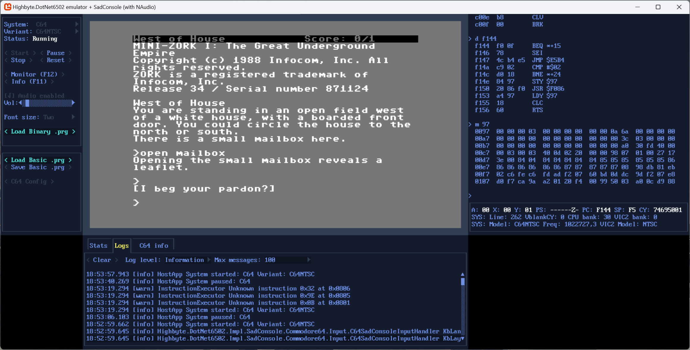

# SadConsole app

Cross-platform desktop app written with [`SadConsole`](https://github.com/Thraka/SadConsole) terminal/ascii/console/game engine.

{ width="25%" }
{ width="38%" }

Technologies:

- UI: `SadConsole` UI controls.
- Rendering: [`Highbyte.DotNet6502.Impl.SadConsole`](../../libraries/implementation/sadconsole.md).
- Input: [`Highbyte.DotNet6502.Impl.SadConsole`](../../libraries/implementation/sadconsole.md).
- Audio: [`Highbyte.DotNet6502.Impl.NAudio`](../../libraries/implementation/naudio.md), playback via `OpenAL`. Two C64 audio providers available: a sample-based one (good but not perfect accuracy — the default) and a command-stream synthesizer one (low CPU but inaccurate). See [C64 audio](../../systems/c64/libraries.md#audio).

## Installation

Manual download, see section in [installation.md](../installation.md)

## Features

### System: C64

- A directory containing the C64 ROM files (Kernal, Basic, Chargen) is supplied by the user. Defaults are set in the `appsettings.json` file, and possible to change in the UI. An auto-download option also exists (license required).

- Renderer provider `Video commands` -> target `Skia commands`
    - Character mode (normal).
    - Only video mode that works in C64 character mode (not multicolor) with built-in characters set from ROM is supported.

- Input using `SadConsole` (MonoGame). Letters, digits and navigation keys work, but **punctuation
  on non-US keyboard layouts is unreliable** — MonoGame's `Keys` enum is layout-dependent and the
  C64 `KeyboardLayout` config setting has no effect here. Prefer the Avalonia, SilkNet or Blazor
  WASM hosts for non-US keyboards. See
  [SadConsole troubleshooting — non-US keyboard layouts](troubleshooting.md#non-us-keyboard-layouts-punctuation-keys)
  and [Systems / C64 / Keyboard mapping](../../systems/c64/keyboard.md#per-host-keyboard-support).

- Audio via [NAudio](https://github.com/naudio/NAudio). Defaults to the sample-based SID
  provider; switch to the command-stream provider in the C64 config dialog if you need
  lower CPU. The SID emulation mode (`Auto` / `Fast`) is selectable in the same dialog.

### System: Generic computer

TODO

### Monitor

Press button or toggle with F12.

### Stats

Press button or toggle with F11.

## How to run locally for development

For development system requirements, see details under [Development](../../home/development.md).

### Prerequisites, compatibility, and troubleshooting

See [SadConsole troubleshooting](troubleshooting.md).

### Visual Studio 2026 or 2022 (Windows)

Open solution `dotnet-6502.sln`.
Set project `Highbyte.DotNet6502.App.SadConsole` as startup, and start with F5.

### VSCode

TODO
