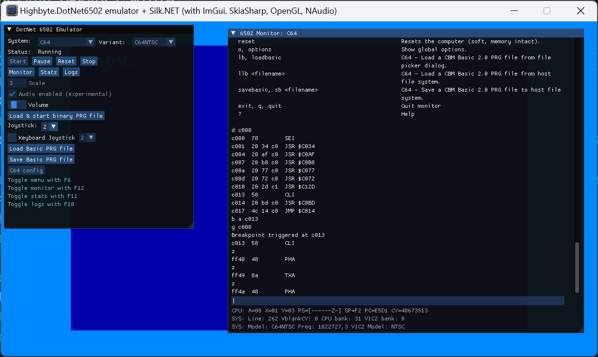

# SilkNetNative app

Cross-platform desktop app written in .NET using [Silk.NET](https://github.com/dotnet/Silk.NET).

{ width="25%" }
{ width="25%" }
{ width="25%" }

Technologies:

- UI: `Silk.NET` [ImGui extensions](https://www.nuget.org/packages/Silk.NET.OpenGL.Extensions.ImGui/).
- Rendering: [`Highbyte.DotNet6502.Impl.Skia`](../../libraries/implementation/skia.md) or [`Highbyte.DotNet6502.Impl.SilkNet`](../../libraries/implementation/silknet.md) (OpenGL) on a `Silk.NET` window.
- Input: [`Highbyte.DotNet6502.Impl.SilkNet`](../../libraries/implementation/silknet.md).
- Audio: [`Highbyte.DotNet6502.Impl.NAudio`](../../libraries/implementation/naudio.md), playback via `OpenAL`. Two C64 audio providers available: a sample-based one (good but not perfect accuracy — the default) and a command-stream synthesizer one (low CPU but inaccurate). See [C64 audio](../../systems/c64/libraries.md#audio).

## Installation

Manual download, see section in [installation.md](../installation.md)

## Features

### System: C64

- A directory containing the C64 ROM files (Kernal, Basic, Chargen) is supplied by the user. Defaults are set in the `appsettings.json` file, and possible to change in the UI.

- Renderer provider `Rasterizer` -> target `Skia 2-layer canvas`
    - Character mode (normal and multi-color).
    - Bitmap mode (normal and bitmap mode).
    - Sprites (normal and multi-color).
    - Rendering of raster lines for border and background colors.

- Renderer provider `Custom` -> target `Skia legacy v1`
    - Character mode (normal and multi-color).
    - Pre-rendered images for each character.
    - Sprites (normal and multi-color).
    - Rendering of raster lines for border and background colors.

- Renderer provider `Custom` -> target `Skia legacy v2`
    - Character mode (normal and multi-color).
    - Bitmap mode (normal and bitmap mode).
    - Sprites (normal and multi-color).
    - Rendering of raster lines for border and background colors.

- Renderer provider `Video commands` -> target `Skia commands`
    - Character mode (normal).

- Renderer provider `Custom GPU packet` -> target `SilkNet OpenGL`
    - Character mode (normal and multi-color).
    - Bitmap mode (normal and bitmap mode).
    - Sprites (normal and multi-color).
    - Rendering of raster lines for border and background colors.

- Renderers using either `SkiaSharp` or `SilkNet` (OpenGL)
    - Character mode (normal and multi-color) with all renderers.
    - Bitmap mode (normal and bitmap mode) with the SkiaSharp2* and SilkNetOpenGL renderers.
    - Sprites (normal and multi-color) with all renderers.
    - Rendering of raster lines for border and background colors with all renderers.

- Input using `SilkNet`. Keyboard uses GLFW's positional keys, so both `US` and `Swedish` C64
  keyboard layouts work; layout is auto-detected from the host (Win32 KLID / macOS `TIS*`) and can
  be overridden from the in-app C64 config UI. See
  [Systems / C64 / Keyboard mapping](../../systems/c64/keyboard.md) for the full host-agnostic mapping.

- Audio via [NAudio](https://github.com/naudio/NAudio). Defaults to the sample-based SID
  provider; switch to the command-stream provider in the in-app C64 config UI if you need
  lower CPU. The SID emulation mode (`Auto` / `Fast`) is selectable in the same UI.

### System: Generic computer

TODO

### UI

#### Menu

A toggleable main menu by pressing F6.

Start and stop of selected system.

Configuration options of selected system.

#### Monitor

A toggleable machine code monitor window by pressing F12.

#### Stats

A toggleable stats window by pressing F11.

## How to run locally for development

For development system requirements, see details under [Development](../../home/development.md).

### Prerequisites, compatibility, and troubleshooting

See [SilkNetNative troubleshooting](troubleshooting.md).

### Visual Studio 2026 or 2022 (Windows)

Open solution `dotnet-6502.sln`.
Set project `Highbyte.DotNet6502.App.SilkNetNative` as startup, and start with F5.

### VSCode

TODO
