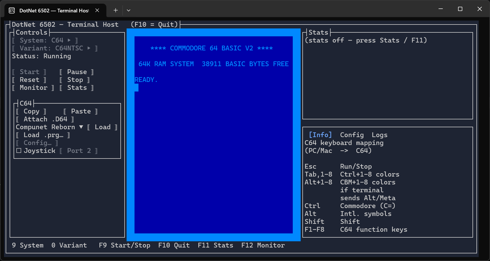

# Terminal (TUI) app

{ width="50%" }

Interactive host app that runs the emulator **inside a real terminal**, using
[Terminal.Gui](https://github.com/gui-cs/Terminal.Gui) v2 for the window/control chrome. The
emulated text-mode screen is rendered as colored Unicode cells, so it works over SSH and inside
`tmux`/`screen`. Text mode only — there is no audio and no bitmap/sprite graphics output.

Technologies:

- UI: [`Terminal.Gui`](https://github.com/gui-cs/Terminal.Gui) v2 controls.
- Rendering: [`Highbyte.DotNet6502.Impl.Terminal`](../../libraries/implementation/terminal.md) — a
  system-agnostic render target that consumes the system's video-command stream into terminal cells.
- Input: [`Highbyte.DotNet6502.Impl.Terminal`](../../libraries/implementation/terminal.md).
- Audio: none (terminals have no audio output).

Like the other host apps, the entry exe holds **no compile-time reference to any emulated system**.
Systems arrive at runtime via plugin discovery: engine plugins (`Impl.Terminal.<System>`) register
the system, and shell plugins (`App.Terminal.Shell.<System>`) contribute the per-system menu, info
panel, and config dialog. See [Architecture](../../architecture.md) and
[Systems.Plugins](../../libraries/core/dotnet6502-systems-plugins.md).

## Terminal requirements

The app drives the terminal with modern features, so it needs a reasonably capable terminal
emulator — older or minimal terminals may render incorrectly:

- **24-bit "true color"** — every emulated screen cell and the UI chrome use explicit RGB colors. On
  a 16/256-color terminal the driver approximates them, so colors look wrong. On Windows, use a
  modern terminal such as Windows Terminal; the legacy `conhost` console does not render true color
  reliably.
- **Unicode (UTF-8) and a capable font** — PETSCII screen codes are mapped to Unicode box-drawing,
  block, and shade glyphs, so the terminal font must include those (most modern monospace fonts do).
- **Size** — large enough for the three-column layout: about **30 rows** tall and a wide window
  (~100 columns) shows everything without the panes clipping. Smaller still runs, but content is
  truncated.
- **Mouse (optional)** — buttons, the per-system menu, and the Info/Config/Logs tabs are clickable
  when the terminal reports mouse events, but every action also has a keyboard command (via the
  leader key, see below), so a mouse is not required.
- **Modifier-key reporting** — some C64 colour-key chords use Alt/Ctrl; whether they reach the
  emulator depends on the terminal forwarding those modifiers (see the in-app Info panel).

It works over SSH and inside `tmux`/`screen` as long as the outer terminal meets the above.

## Supported systems

- **C64** (`Impl.Terminal.Commodore64` + `App.Terminal.Shell.Commodore64`) — character mode only.
  PETSCII graphics screen codes are mapped best-effort to Unicode box-drawing / block / shade glyphs
  for the built-in (uppercase/graphics) charset.
- **VIC-20** (`Impl.Terminal.Vic20` + `App.Terminal.Shell.Vic20`) — character mode only.

The screen pane resizes automatically to fit the running system's frame (C64 ≈ 40 columns,
VIC-20 ≈ 22 columns), and the status/logs column reflows around it. The emulated screen is drawn
without an extra framing box — each system renders its own coloured screen border, which is wide and
wasteful in a terminal, so the view crops it down to a thin, consistent border on every side. This
keeps the C64 (29 cells tall including its border) within a default ~30-row terminal without the user
having to enlarge the window. How much border to keep on each side is configurable in
`appsettings.json`: `VerticalBorderRows` (top/bottom, default `1`) and `HorizontalBorderColumns`
(left/right, default `2`); set either to `0` to show the full emulated border on that axis.

## Layout and controls

The window has a **Controls** column (left), the **Screen** in the middle, and a **Stats** box plus
a tabbed **Info / Config / Logs** pane on the right. A per-system menu (contributed by the shell
plugin) appears below the standard controls.

### Host commands (leader key)

A running emulator claims almost every key, and terminals/window managers reserve the rest (`F10` =
menu, `F11` = fullscreen, `Ctrl`/`Alt`/`Shift` = emulator modifiers), so there is no room for a row
of direct host hotkeys. Instead, host commands hang off a single **leader key** — press it to arm
*host mode*, then press one command key:

| Press `F9`, then… | Action |
|-------------------|--------|
| `S` | Start / Stop toggle |
| `M` | Toggle the **Monitor** |
| `T` | Toggle the **Stats** (instrumentation) box |
| `U` | Open the **Updates** dialog (see [Updates](#updates)) |
| `Q` | Quit the app |
| `Y` | Cycle the selected **System** (only while stopped) |
| `V` | Cycle the selected **Variant** (only while stopped) |
| `Tab` | Toggle focus between the emulator screen and the host UI (see below) |
| `Esc` (or any other key) | Cancel host mode |

The bottom line shows just the leader-key reminder (e.g. `[UI NAV]  F9 Menu`) normally, so it is
obvious when host mode is *not* active; it expands to the full command menu only while host mode is
armed. Every command also has a button in the **Controls** column — including a **Quit** button — so a
mouse works without the keyboard. (Terminals offer no clickable window close control, and `Esc` is
reserved for the emulator's RUN/STOP, so quitting is via the **Quit** button or `F9` `Q`.)

The leader key defaults to `F9` because it is reliable across terminals (unlike `F10`/`F11`). If your
terminal grabs `F9`, rebind it with the `LeaderKey` setting in `appsettings.json` (any `KeyCode` name,
e.g. `"F12"`). Host mode is suppressed while a modal dialog (config, file picker, monitor) is open, so
keys reach the dialog's fields normally. `F1`–`F8` are reserved for the emulated systems (e.g. the C64
function keys).

### Keyboard navigation (focus modes)

There are two focus modes; `F9` `Tab` (or `F9` `F6`) toggles between them, and the bottom-line
indicator (`[EMULATOR]` / `[UI NAV]`) shows which is active:

- **Emulator mode** — the emulator screen has focus, so every key (except the leader key) goes to the
  emulated machine. The host-UI panels are **dimmed** to signal they're inactive. Start/Resume enters
  this mode automatically.
- **UI mode** — focus is on the host controls, so the keyboard navigates every control with no
  per-control shortcuts. Stopping or pausing the emulator returns to this mode automatically.

While the emulator is running it owns every key, so plain `Tab`/`F6` reach the machine, not the host.
The leader key is the way out: press **`F9` then `Tab`** (or `F9` `F6`) to hand the keyboard back to
the host UI. The same `F9` `Tab` gives it back to the emulator. (The emulator screen is also kept out
of the `Tab`/`F6` rings, so once in UI mode navigation never falls back into it by accident.)

In UI mode the controls are organised into **areas**, each a Terminal.Gui *tab group*: the **Controls
column**, the **per-system menu** (e.g. the C64 menu), and the **Info/Config/Logs pane**. Focus is
scoped per area — `Tab` stays within one area and `F6` moves between them:

| Key | Moves focus |
|-----|-------------|
| `Tab` / `Shift+Tab` | Next / previous control **within** the current area |
| `F6` / `Shift+F6` | Next / previous **area** (Controls → per-system menu → tabbed pane) |
| `↑` `↓` `←` `→` | Within a control (tab strip, log list, radio group, …) |
| `Enter` / `Space` | Activate the focused button / toggle |

So to reach the C64 menu buttons, press `F6` to step into the C64 menu area, then `Tab` to cycle its
buttons. The emulator screen is deliberately left out of these rings; enter it with Start/Resume or
`F9` `Tab`.

## Config dialog

Each system contributes a **Config** dialog (opened from its menu) for editing settings while the
emulator is stopped, with live validation:

- **C64** — ROM directory/files (with auto-download), SwiftLink (enable, cartridge I/O address,
  interrupt mode, receive mode, transport, TCP host/port, connect-on-boot), and keyboard joystick
  (enable + port 1/2). Keyboard-joystick settings can also be toggled live from the C64 menu.
- **VIC-20** — ROM directory/files (with auto-download).

See [Systems / C64 / ROMs](../../systems/c64/roms.md), [Systems / VIC-20 / ROMs](../../systems/vic20/roms.md),
and [Systems / C64 / SwiftLink](../../systems/c64/swiftlink.md).

The shipped `appsettings.json` contains packaged defaults. User changes are saved to the Terminal host's `appsettings.user.json` under the OS local application data folder, not beside the shipped executable. Empty ROM directory settings use the shared user content folders under `~/Documents/Highbyte/DotNet6502/roms` (or the Windows Documents equivalent).

## Monitor

Press the **Monitor** button or `F9` `M` (while a system is running or paused) to open the built-in
6502 machine-code monitor — the same command set as the other host apps' monitor (type `?` for
help). It opens full-screen over the UI, shows the accumulated output plus the current CPU/system
status, and has a command input line. While the monitor is open, emulation is halted so the
monitor has exclusive access to the CPU and memory; closing it (`Esc`) or a `g` (go) command
resumes. Breakpoints and other break triggers open the monitor automatically.

Load/save commands that take no filename (`l`, and the C64 `lb`) open a terminal file picker;
the `ll <file>` / `llb <file>` variants take an explicit path. See
[Monitor library](../../libraries/core/dotnet6502-monitor.md).

## Stats

Press the **Stats** button or `F9` `T` to show host instrumentation (FPS, per-frame timings, …) in the
right-hand box while a system runs.

## Updates

On a package-manager install (Homebrew formula or Scoop) the app checks about once a day for a newer
release. Because a full-screen TUI has no useful stdout, the result surfaces **inside** the TUI:

- A one-line notice in the **Logs** tab (right-hand pane) when an update is available.
- An **update-available indicator** appended to the window title and the bottom hint line
  (e.g. `★ Update available (F9 U)`), so it never steals emulator keyboard focus.

Press `F9` `U` to open the **Updates** dialog. It shows the current version and update status and, on a
package-manager install with a newer release, the exact `brew`/`scoop` command plus:

- **Check now** — force an immediate check (ignores the on/off setting).
- **Update now** — quit the TUI and run the package-manager upgrade in the foreground (its output is
  shown on the plain console); restart the app afterwards to use the new version.

Manual-download and development builds report *not managed* and do no update check. The automatic check
is controlled by the top-level `UpdateCheckEnabled` key in `appsettings.json` (default `true`) and is
suppressed when `DOTNET6502_NO_UPDATE_CHECK` or `CI` is set; the CLI flags `--version` /
`--check-update` / `--update` remain available (see [Staying up to date](../installation.md#staying-up-to-date)).

## How to run locally for development

For development system requirements, see [Development](../../home/development.md). The Terminal app
needs a real TTY, so run it from a terminal (not a debugger output pane).

### From the command line

```sh
dotnet run --project src/apps/Terminal/Highbyte.DotNet6502.App.Terminal
```

A headless self-test that needs no TTY (boots a system, runs a number of frames, and dumps the
rendered screen as text) is useful for CI / smoke testing:

```sh
dotnet run --project src/apps/Terminal/Highbyte.DotNet6502.App.Terminal -- --selftest --frames 400 --system C64
```

### VS Code

Use the **Terminal (TUI) - Launch** configuration. It runs in an external terminal window — a real
TTY, and better suited to a full-screen TUI than the integrated terminal (and unlike the VS Code
Debug Console, which redirects I/O and has no TTY at all). **Terminal (TUI) - Launch (Self-test)**
runs the headless self-test (in the integrated terminal, since it needs no TTY).

## Limitations

- Text (character) mode only — no bitmap, multicolor, or sprite graphics are rendered.
- No audio.
- PETSCII graphics are approximated with the nearest common Unicode glyphs, so they will not match
  the C64 exactly.

See [Terminal requirements](#terminal-requirements) for the terminal capabilities the app needs, and
[Limitations](../../home/limitations.md) for general project limitations.
