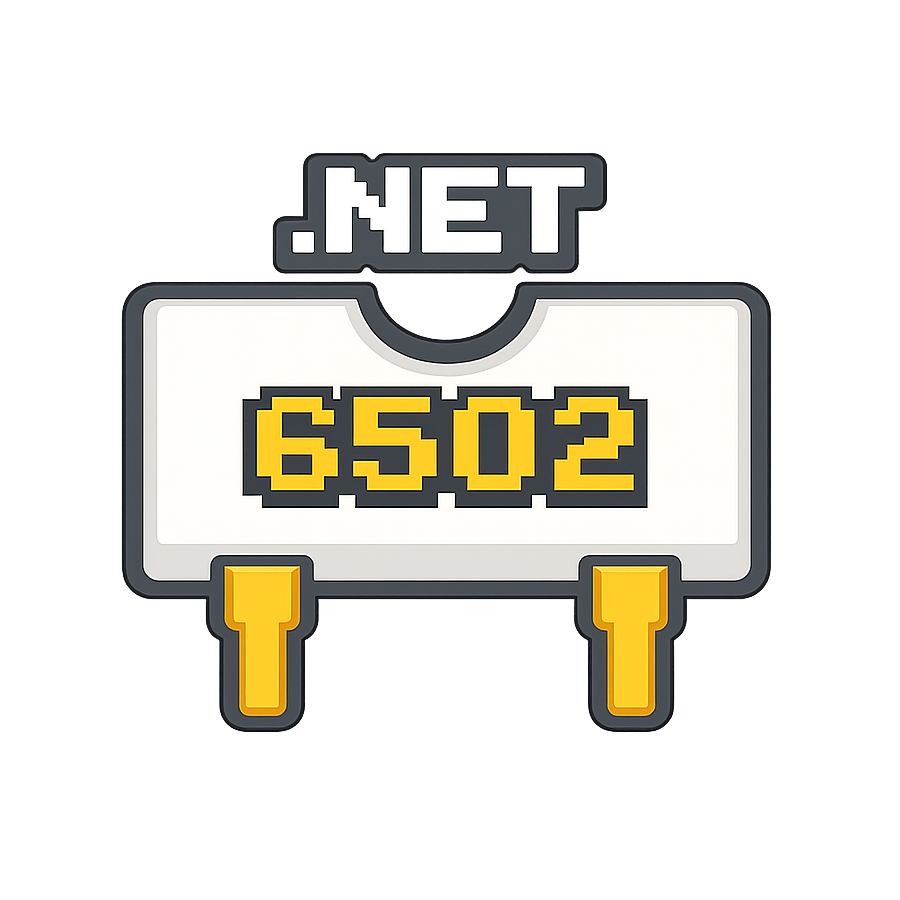
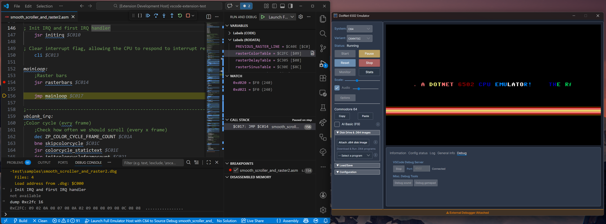
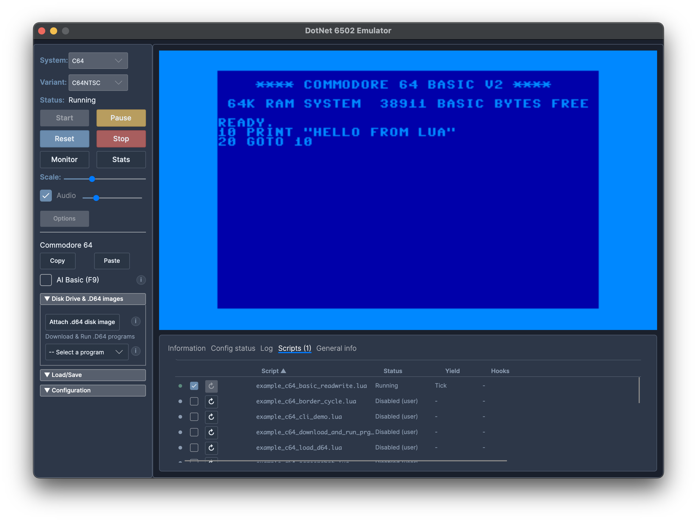
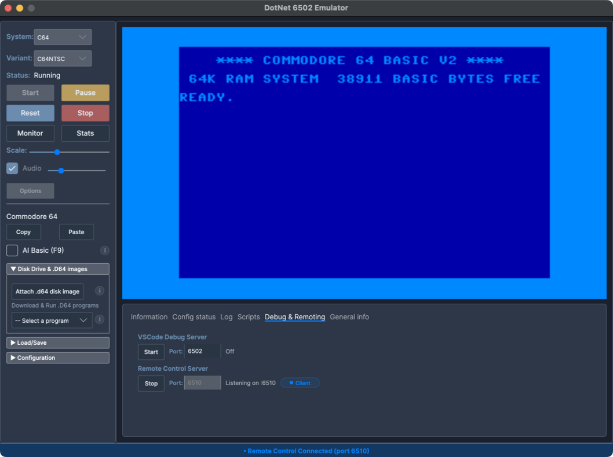
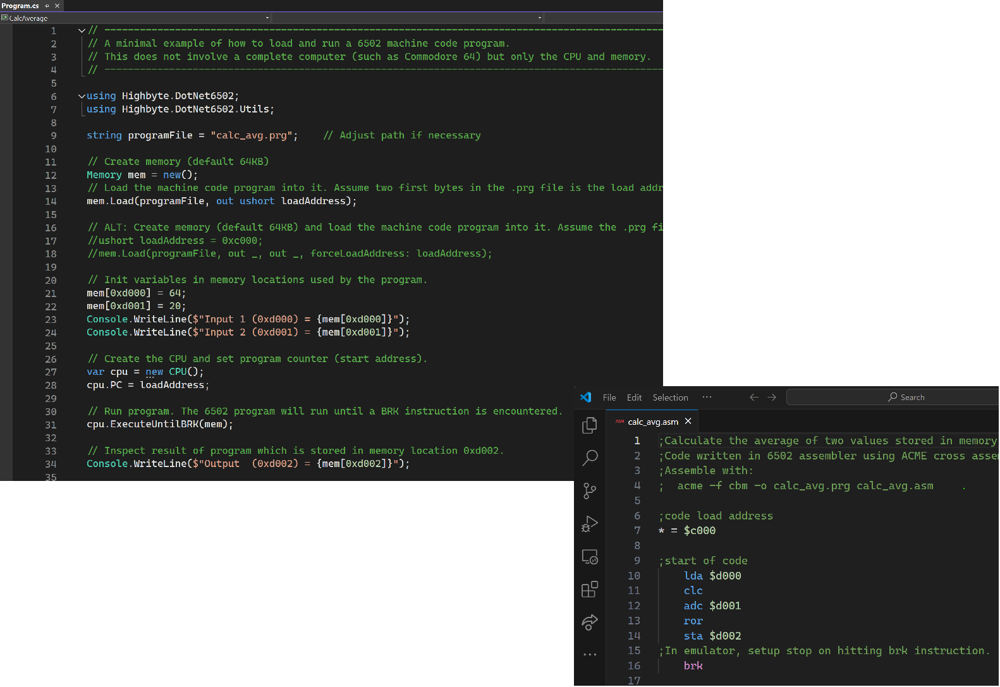
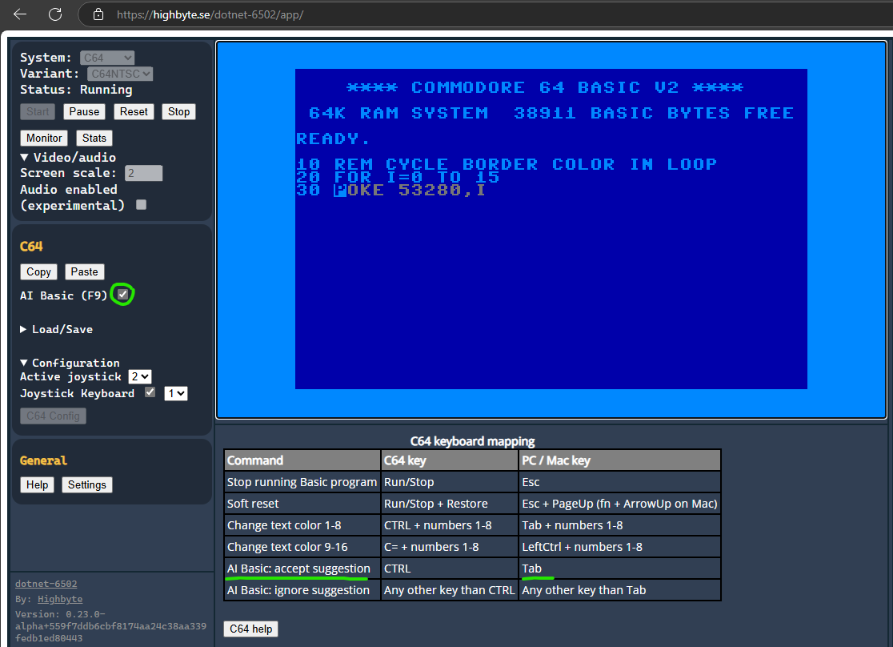

# dotnet-6502

  

A [6502 CPU](https://en.wikipedia.org/wiki/MOS_Technology_6502) emulator for .NET — cross-platform libraries and applications for executing 6502 machine code, and emulating specific computer systems (such as the Commodore 64) in different UI contexts.

!!! note
    This is mainly a programming exercise that may or may not turn into something more. See [Limitations](home/limitations.md).

## Where to start

- **Try it now** — [Avalonia Browser app](host-apps/avalonia/browser.md) (runs in a browser, no install)
- **Run on desktop** — [Desktop apps installation](host-apps/installation.md) (Windows, macOS, Linux)
- **Use the library** — [`Highbyte.DotNet6502`](libraries/core/dotnet6502.md) for embedding 6502 code execution in your own .NET app

## Web apps

| [Avalonia Browser app](host-apps/avalonia/browser.md) | [Blazor Web Assembly app](host-apps/blazor-wasm/overview.md) |
| ---------------------------------------------------- | -------------------------------------------------- |
|  |  |

## Desktop apps

| [Avalonia Desktop](host-apps/avalonia/desktop.md) | [SadConsole](host-apps/sadconsole/overview.md) | [SilkNetNative](host-apps/silknet-native/overview.md) |
| ---------------------------------------------------- | ---------------------------------------- | ----------------------------------------------- |
|  |  |  |

See [Desktop apps installation](host-apps/installation.md) for download links and instructions for Windows, Linux, and macOS.

## Terminal (TUI) app

[Terminal (TUI) app](host-apps/terminal/overview.md) — runs the emulator interactively inside a real terminal, rendering the emulated text-mode screen as colored Unicode cells via [Terminal.Gui](https://github.com/gui-cs/Terminal.Gui). Works over SSH and in `tmux`/`screen`. Supports the C64 and VIC-20 in character mode (no audio, no bitmap/sprite graphics), and includes the built-in machine code monitor.

## Headless app

[Headless app](host-apps/headless/overview.md) — runs the emulator without any UI, rendering, audio, or user input. Controlled entirely via CLI arguments and Lua scripts. Useful for automation, scripting, and CI workflows.

## Featured tools

| [VS Code debugger extension](tools/vscode-debugger/debugging.md) | [Lua scripting](tools/scripting/overview.md) | [Remote control](tools/remote-control/overview.md) |
| ---------------------------------------------------------------- | -------------------------------------------- | -------------------------------------------------- |
|  |  |  |

## Other features

| [Run 6502 machine code in your own .NET apps](libraries/core/dotnet6502.md) | [Machine code monitor](libraries/core/dotnet6502-monitor.md) | [C64 Basic AI code completion](systems/c64/code-completion.md) |
| --------------------------------------------------------------------------- | ------------------------------------------------------------ | -------------------------------------------------------------- |
|  |  |  |

For full library reference, see [Libraries](libraries/overview.md).
