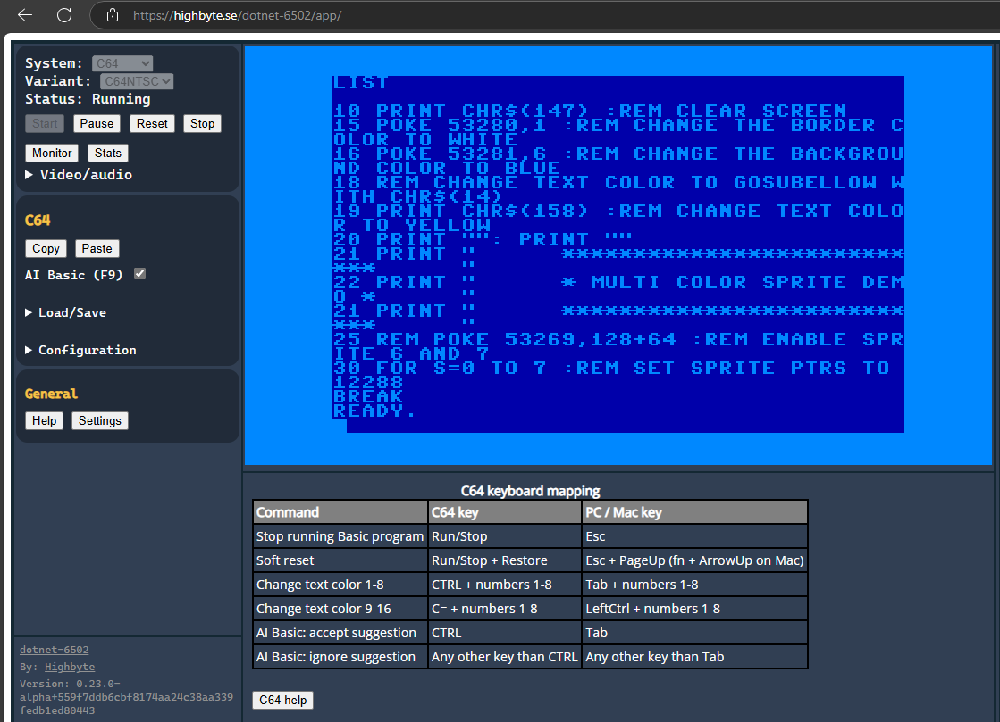
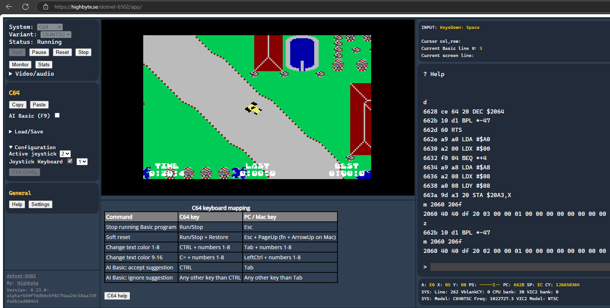

# Blazor Web Assembly app

## Overview

Web app written with [Blazor WebAssembly](https://dotnet.microsoft.com/en-us/apps/aspnet/web-apps/blazor).

{ width="25%" }
{ width="25%" }
{ width="36%" }

Technologies:

- UI: `Blazor` UI controls.
- Rendering: [`Highbyte.DotNet6502.Impl.Skia`](../libraries/implementation/skia.md). Using [`SkiaSharp.Views.Blazor`](https://www.nuget.org/packages/SkiaSharp.Views.Blazor) library to provide a Canvas for drawing on with [`SkiaSharp`](https://www.nuget.org/packages/SkiaSharp).
- Input: [`Highbyte.DotNet6502.Impl.AspNet`](../libraries/implementation/aspnet.md).
- Audio: [`Highbyte.DotNet6502.Impl.AspNet`](../libraries/implementation/aspnet.md). Custom `WebAudio JS interop` for synthesizer and playback.

Live version: <https://highbyte.se/dotnet-6502/app>

## Features

### System: C64

- Via the C64 config UI you have to upload binaries for the ROMs that a C64 uses (Kernal, Basic, Chargen). Or use the convenient auto-download functionality (with a license notice).

- Renderer provider `Rasterizer` -> target `Skia 2-layer canvas`
    - Character mode (normal and multi-color).
    - Bitmap mode (normal and bitmap mode).
    - Sprites (normal and multi-color).
    - Rendering of raster lines for border and background colors.

- Renderer provider `Custom` -> target `Skia legacy v1`
    - Character mode (normal and multi-color).
    - Pre-rendered images for each character.
    - Sprites (normal and multi-color).
    - Rendering of raster lines for border and background colors.

- Renderer provider `Custom` -> target `Skia legacy v2`
    - Character mode (normal and multi-color).
    - Bitmap mode (normal and bitmap mode).
    - Sprites (normal and multi-color).
    - Rendering of raster lines for border and background colors.

- Renderer provider `Video commands` -> target `Skia commands`
    - Character mode (normal).

- Input using `AspNet`.

- Audio via `WebAudio` synthesizer using .NET → JavaScript interop.

### System: Generic computer

The example 6502 machine code that is loaded and run by default for the *Generic* computer is an assembled version of [this 6502 assembly code](https://github.com/highbyte/dotnet-6502/blob/master/samples/Assembler/Generic/hostinteraction_scroll_text_and_cycle_colors.asm).

### UI

#### Menu

Start and stop of selected system.

Configuration options of selected system.

#### Monitor

A Blazor WASM implementation of the [machine code monitor](../libraries/core/dotnet6502-monitor.md) is available by pressing F12.

#### Stats

A toggleable stats window by pressing F11.

## How to run locally for development

For development system requirements, see details under [Development](../home/development.md).

### Visual Studio (Windows)

Open solution `dotnet-6502.sln`.
Set project `Highbyte.DotNet6502.App.WASM` as startup, and start with F5.

!!! important
    Running a Debug build of the Blazor WASM app is very slow. To get acceptable performance a published release build with AOT is required. It can make local debugging tricky sometimes.

### From command line (Windows, Linux, Mac)

#### Run Debug build

```sh
cd ./src/apps/Highbyte.DotNet6502.App.WASM
dotnet run
```

Open browser at <http://localhost:5000>.

#### Run optimized Publish build

To serve the published build the example below uses the .NET global tool `dotnet-serve`. Install with `dotnet tool install --global dotnet-serve`.

```powershell
cd ./src/apps/Highbyte.DotNet6502.App.WASM
if(Test-Path ./bin/Publish/) { del ./bin/Publish/ -r -force }
dotnet publish -c Release -o ./bin/Publish/
dotnet serve -o:/ --directory ./bin/Publish/wwwroot/
```

A browser is automatically opened.
